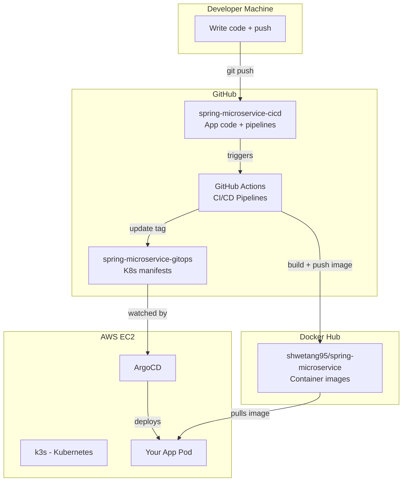

# CI/CD Pipeline - Complete Learning Guide

A beginner-friendly, step-by-step guide to building a production-grade CI/CD pipeline from scratch.

---

## 📚 Documentation Index

Read these in order:

| # | File | Topic | What you'll learn |
|---|------|-------|-------------------|
| 1 | [01-OVERVIEW.md](./01-OVERVIEW.md) | What & Why | What CI/CD is, why we need it, big picture |
| 2 | [02-TOOLS.md](./02-TOOLS.md) | Tools | Every tool explained — what, why, alternatives |
| 3 | [03-SPRING-BOOT-APP.md](./03-SPRING-BOOT-APP.md) | Application | The Java app, every file explained line by line |
| 4 | [04-DOCKERFILE.md](./04-DOCKERFILE.md) | Docker | Dockerfile explained, multi-stage builds, commands |
| 5 | [05-GITHUB-ACTIONS-CI.md](./05-GITHUB-ACTIONS-CI.md) | CI Pipeline | ci.yml line-by-line, triggers, jobs, steps |
| 6 | [06-GITHUB-ACTIONS-CD.md](./06-GITHUB-ACTIONS-CD.md) | CD Pipeline | cd.yml line-by-line, push, GitOps update, versioning |
| 7 | [07-DOCKER-HUB.md](./07-DOCKER-HUB.md) | Container Registry | Docker Hub setup, tokens, how images are stored |
| 8 | [08-GITOPS-REPO.md](./08-GITOPS-REPO.md) | GitOps | What it is, K8s manifests explained, how ArgoCD uses it |
| 9 | [09-KUBERNETES.md](./09-KUBERNETES.md) | Kubernetes | k3s setup, pods, services, namespaces, ConfigMaps, Secrets |
| 10 | [10-ARGOCD.md](./10-ARGOCD.md) | ArgoCD | Installation, configuration, connecting repos, sync, rollback |
| 11 | [11-SECRETS-AND-TOKENS.md](./11-SECRETS-AND-TOKENS.md) | Credentials | Every token/secret needed, how to create them, where to put them |
| 12 | [12-VERSIONING.md](./12-VERSIONING.md) | Versioning | Auto semantic versioning, tags, Docker tags |
| 13 | [13-TESTING-THE-PIPELINE.md](./13-TESTING-THE-PIPELINE.md) | Testing | How to test the full flow end-to-end |
| 14 | [14-TROUBLESHOOTING.md](./14-TROUBLESHOOTING.md) | Problems | Every error we hit and how to fix it |
| 15 | [15-INFRASTRUCTURE-SCRIPTS.md](./15-INFRASTRUCTURE-SCRIPTS.md) | Scripts | userdata.sh, setup-argocd.sh, sync.sh explained line-by-line |

---

## 🏗️ Architecture Diagram



---

## 🔗 Live URLs

| Service | URL | Credentials |
|---------|-----|-------------|
| App API | http://35.175.240.246:32130 | None needed |
| ArgoCD Dashboard | http://35.175.240.246:30080 | admin / XvKzqiOZtKDZCbLg |
| GitHub Actions | https://github.com/Shway95/spring-microservice-cicd/actions | Your GitHub login |
| Docker Hub | https://hub.docker.com/r/shwetang95/spring-microservice | Your Docker Hub login |
| Version Tags | https://github.com/Shway95/spring-microservice-cicd/tags | Your GitHub login |

---

## ⚡ Quick Start (if you just want to test)

```bash
# 1. Make a code change
echo "// test" >> SomeFile.java

# 2. Commit and push to main
git add . && git commit -m "test change" && git push

# 3. Watch the pipeline run
# Go to: https://github.com/Shway95/spring-microservice-cicd/actions

# 4. After pipeline passes, check new version tag
# Go to: https://github.com/Shway95/spring-microservice-cicd/tags

# 5. ArgoCD auto-deploys, verify:
curl http://35.175.240.246:32130/actuator/health
```
