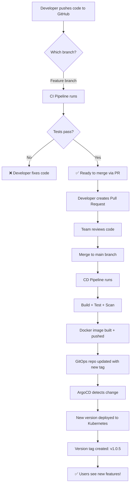

# 01 - What is CI/CD and Why Do We Need It?

---

## What is CI/CD?

### CI = Continuous Integration

**In simple words:** Every time you push code, a robot automatically checks if your code works.

**What it does:**
- Downloads your code
- Tries to build/compile it
- Runs all your tests
- Checks for security issues
- Tells you if something is broken

**Analogy:** Think of it like a spell-checker for code. Every time you write something, it instantly checks for errors.

### CD = Continuous Delivery / Deployment

**In simple words:** After the robot confirms your code works, it automatically packages it and sends it to the server where users can access it.

**What it does:**
- Packages your app into a Docker container (like putting it in a shipping box)
- Uploads the container to a registry (like a warehouse)
- Updates the server to use the new version
- Users see the new features immediately

**Analogy:** Like Amazon — once the product passes quality check, it's automatically packed, shipped, and delivered to your door.

---

## Why Do We Need This?

### Without CI/CD (Manual Process)

```
1. Developer writes code
2. Developer runs tests manually (sometimes forgets)
3. Developer builds the app manually
4. Developer copies files to the server manually (scp, FTP)
5. Developer restarts the server manually
6. If something breaks → panic, manually fix, roll back by hand
7. Process takes: 30 minutes to several hours
```

### With CI/CD (Automated Process)

```
1. Developer pushes code
2. Everything else happens AUTOMATICALLY in 5 minutes
3. If something breaks → pipeline fails before deployment
4. Rollback → revert one commit
```

### Real-world comparison

| Scenario | Without CI/CD | With CI/CD |
|----------|--------------|-----------|
| You push broken code | Nobody knows until production crashes | Pipeline fails in 2 minutes, code never reaches users |
| You accidentally commit a password | It's in production, hackers find it | Gitleaks catches it, pipeline blocks the merge |
| Docker image has a vulnerability | You'd never know | Trivy catches it immediately |
| Need to deploy on Friday | Scary, risky, team stays late | Same as any other day, automated and safe |
| Need to roll back | SSH into server, find old version, manually restore | Click one button or `git revert` |
| New developer joins team | "How do I deploy?" — no documentation | Push code, pipeline handles everything |

---

## The Complete Flow (High Level)



---

## Key Concepts

### Pipeline
A series of automated steps that run one after another. Like a factory assembly line — each step transforms the raw material (code) into a finished product (deployed application).

### Trigger
What starts the pipeline. In our case: pushing code to GitHub.

### Job
A group of steps that run together on one machine. Example: "Build, Test & Scan" is one job.

### Step
A single action within a job. Example: "Run tests" is one step.

### Artifact
Something produced by the pipeline. Example: a Docker image.

### Registry
Where Docker images are stored. Like a library for containers. We use Docker Hub.

### GitOps
A practice where Git is the "single source of truth" for what should be running on your servers. You change a file in Git → the server automatically updates.

### Rollback
Going back to a previous version when something goes wrong. Like pressing "undo" on a deployment.
