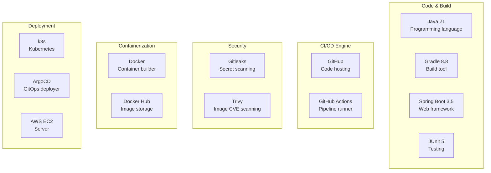

# 02 - Tools We Used (What, Why, How)

Every tool in our CI/CD pipeline explained for beginners.

---

## Tool Map

---

## 1. Java 21

| | |
|--|--|
| **What** | A programming language. Our application is written in Java. |
| **Why 21?** | Latest LTS (Long Term Support) version. Gets security updates for years. |
| **Where** | `src/main/java/` — all `.java` files |
| **Alternative** | Java 17 (previous LTS), Python, Node.js, Go |

---

## 2. Spring Boot 3.5

| | |
|--|--|
| **What** | A Java framework that makes it easy to create web applications and REST APIs. |
| **Why** | Most popular Java framework, huge community, built-in features (health checks, config management, testing). |
| **Where** | `build.gradle` → `org.springframework.boot` plugin |
| **What it gives us** | REST API endpoints, automatic JSON handling, health endpoint (`/actuator/health`), environment variable reading |
| **Alternative** | Quarkus, Micronaut, plain Java |

---

## 3. Gradle 8.8

| | |
|--|--|
| **What** | A build tool. It compiles Java code, runs tests, creates JAR files. |
| **Why** | Faster than Maven, more flexible, Kotlin/Groovy DSL for config. |
| **Where** | `build.gradle` (config), `gradle/wrapper/` (version pinning) |
| **Key commands** | `gradle build` (compile), `gradle test` (run tests), `gradle bootJar` (create deployable JAR) |
| **Alternative** | Maven (uses `pom.xml` instead of `build.gradle`) |

**Why pin to 8.8?** Gradle 9.x is incompatible with Spring Boot 3.5. Always check compatibility.

---

## 4. JUnit 5 + JaCoCo

| | |
|--|--|
| **What** | JUnit = testing framework. JaCoCo = code coverage tool. |
| **Why** | JUnit is the standard for Java testing. JaCoCo shows what % of your code is tested. |
| **Where** | `src/test/java/` (tests), `build.gradle` (JaCoCo plugin) |
| **What they produce** | Test results (pass/fail) + coverage report (XML/HTML) |

---

## 5. GitHub

| | |
|--|--|
| **What** | A website that hosts Git repositories (your code). |
| **Why** | Free, widely used, has GitHub Actions built-in, PR reviews, issue tracking. |
| **Our repos** | `spring-microservice-cicd` (app), `spring-microservice-gitops` (K8s manifests) |
| **Alternative** | GitLab, Bitbucket, Azure DevOps |

---

## 6. GitHub Actions

| | |
|--|--|
| **What** | A CI/CD service built into GitHub. Runs automated workflows when you push code. |
| **Why** | Free (2000 min/month), no separate server needed, native GitHub integration. |
| **Where** | `.github/workflows/ci.yml` and `.github/workflows/cd.yml` |
| **How it works** | You define YAML files that describe steps. GitHub runs them on their servers (called "runners"). |
| **Alternative** | Jenkins, GitLab CI, CircleCI, Travis CI |

**Key concepts:**
- **Workflow** = the entire YAML file (ci.yml or cd.yml)
- **Job** = a group of steps that run on one machine
- **Step** = a single command or action
- **Runner** = the virtual machine that runs your pipeline (Ubuntu in our case)
- **Action** = a reusable step made by someone else (like `actions/checkout@v4`)

---

## 7. Docker

| | |
|--|--|
| **What** | A tool that packages your app + all its dependencies into a "container" — a standardized box that runs anywhere. |
| **Why** | "Works on my machine" problem solved. Same container runs on your laptop, CI server, and production. |
| **Where** | `Dockerfile` in your project root |
| **Key commands** | `docker build` (create image), `docker push` (upload), `docker run` (start container) |
| **Alternative** | Podman, Buildah |

**Key concepts:**
- **Image** = a blueprint/template (like a class in programming)
- **Container** = a running instance of an image (like an object)
- **Registry** = where images are stored (Docker Hub)
- **Tag** = a version label for an image (like `v1.0.0` or `main-abc123`)

---

## 8. Docker Hub

| | |
|--|--|
| **What** | A cloud service that stores Docker images. Like GitHub but for containers. |
| **Why** | Free (1 private repo, unlimited public), easy to use, most common registry. |
| **Our image** | `shwetang95/spring-microservice` |
| **How it's used** | Pipeline pushes image → K8s pulls image from here |
| **Alternative** | AWS ECR, GitHub Container Registry (GHCR), Google Artifact Registry |

---

## 9. Gitleaks

| | |
|--|--|
| **What** | A tool that scans your Git repository for accidentally committed secrets (passwords, API keys, tokens). |
| **Why** | Developers sometimes accidentally commit `.env` files or hardcode credentials. Gitleaks catches this before it becomes a security breach. |
| **Where** | Runs as a step in both CI and CD pipelines |
| **How** | Scans all files + entire Git history for patterns that look like secrets |
| **Alternative** | TruffleHog, git-secrets |

---

## 10. Trivy

| | |
|--|--|
| **What** | A vulnerability scanner that checks Docker images for known security issues (CVEs). |
| **Why** | Your Docker image contains an OS + libraries. Any of them might have known vulnerabilities. Trivy checks a database of known CVEs against everything in your image. |
| **Where** | Runs after Docker image is built, before pushing |
| **How** | Downloads CVE database → scans image layers → reports Critical/High/Medium/Low issues |
| **Alternative** | Snyk, Clair, Anchore |

**Severity levels:**
- **CRITICAL** = remote code execution, must fix immediately
- **HIGH** = serious but harder to exploit
- **MEDIUM** = moderate risk
- **LOW** = minor issues

---

## 11. k3s (Kubernetes)

| | |
|--|--|
| **What** | Lightweight Kubernetes. Same K8s API, but packaged as a single binary. |
| **Why** | Full Kubernetes (EKS) costs $72/month just for the control plane. k3s is free and installs in one command. Perfect for learning. |
| **Where** | Installed on our EC2 instance |
| **How** | `curl -sfL https://get.k3s.io | sh -` — that's it! |
| **Alternative** | minikube (local), kind (Docker-based), EKS (production AWS) |

**Key K8s concepts:**
- **Pod** = smallest unit, runs one or more containers
- **Deployment** = manages pods (how many, what image, restart policy)
- **Service** = gives pods a stable network endpoint
- **Namespace** = logical separation (dev, test, prod)
- **ConfigMap** = non-sensitive config (environment variables)
- **Secret** = sensitive config (passwords, keys)

---

## 12. ArgoCD

| | |
|--|--|
| **What** | A GitOps continuous deployment tool for Kubernetes. Watches a Git repo and automatically deploys changes. |
| **Why** | Visual dashboard, automatic sync, easy rollback, declarative (desired state in Git = actual state in cluster). |
| **Where** | Installed on our k3s cluster, watches the GitOps repo |
| **How** | You tell it "watch this repo/folder" → when that folder changes → ArgoCD applies the changes to K8s |
| **Alternative** | Flux CD, manual `kubectl apply` |

**How ArgoCD works:**
1. You define an "Application" in ArgoCD pointing to a Git repo + folder
2. ArgoCD polls the repo every 3 minutes (or uses webhooks)
3. If it detects a change (new commit) → compares desired state vs live state
4. If out of sync → applies the new manifests to the cluster
5. Shows everything in a beautiful web UI

---

## 13. AWS EC2

| | |
|--|--|
| **What** | A virtual server in Amazon's cloud. |
| **Why** | Need a machine to run Kubernetes + ArgoCD. t3.medium ($0.04/hr) is enough for learning. |
| **Our instance** | `i-01129c507d452d443`, t3.medium, Ubuntu 22.04, us-east-1 |
| **Cost** | ~$30/month if always on. ~$1.60/month if stopped (pay only for disk). |
| **Alternative** | Google Cloud VM, Azure VM, DigitalOcean, local machine with minikube |

---

## Tool Decision Matrix

| Need | Tool We Chose | Why Not Others |
|------|--------------|----------------|
| Build Java | Gradle | Maven is slower, less flexible |
| CI/CD | GitHub Actions | Jenkins needs its own server, GitLab requires migration |
| Secret scanning | Gitleaks | Free, fast, accurate |
| Image scanning | Trivy | Free, comprehensive CVE database |
| Container registry | Docker Hub | Free tier, simplest setup |
| Kubernetes | k3s | EKS costs $72/month, k3s is identical API but free |
| GitOps | ArgoCD | Has a UI (Flux CD doesn't), easier for learning |
| Server | EC2 | Most common, cheap, AWS CLI already configured |
