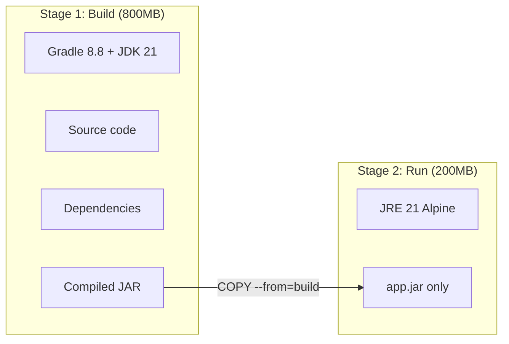

# 04 - Dockerfile Explained (Every Line)

---

## What is a Dockerfile?

A Dockerfile is a recipe/instructions for building a Docker image. It tells Docker:
1. Start with this base operating system
2. Copy these files
3. Run these commands
4. This is how to start the app

---

## Our Dockerfile (Line by Line)

```dockerfile
# ============================================
# STAGE 1: BUILD
# ============================================
# Start with a "big" image that has Gradle + JDK (we need these to compile)
FROM gradle:8.8-jdk21 AS build

# Set the working directory inside the container
WORKDIR /app

# Copy build configuration files first (for Docker layer caching)
# If these don't change, Docker reuses the cached layer = faster builds
COPY build.gradle settings.gradle ./
COPY gradle ./gradle

# Download all dependencies (cached if build.gradle hasn't changed)
RUN gradle dependencies --no-daemon || true

# Copy the actual source code
COPY src ./src

# Build the application (creates a JAR file in build/libs/)
RUN gradle bootJar --no-daemon


# ============================================
# STAGE 2: RUN
# ============================================
# Start with a "tiny" image that only has JRE (Java Runtime)
# Alpine = minimal Linux, ~5MB base
FROM eclipse-temurin:21-jre-alpine

# Set working directory
WORKDIR /app

# Copy ONLY the built JAR from stage 1 (not the source code, not Gradle)
COPY --from=build /app/build/libs/*.jar app.jar

# Security: Create a non-root user
# Never run containers as root! If the app gets hacked, attacker has limited permissions
RUN addgroup -S appgroup && adduser -S appuser -G appgroup
USER appuser

# Document which port the app uses (informational only)
EXPOSE 8080

# Health check: Docker/K8s can check if the app is alive
HEALTHCHECK --interval=30s --timeout=3s --retries=3 \
  CMD wget -qO- http://localhost:8080/actuator/health || exit 1

# The command to run when the container starts
ENTRYPOINT ["java", "-jar", "app.jar"]
```

---

## Why Multi-Stage Build?



| | Single-stage | Multi-stage (ours) |
|--|--|--|
| **Image size** | ~800MB | ~200MB |
| **Contains** | JDK, Gradle, source code, tests, dependencies | Only JRE + your JAR |
| **Security** | Attack surface is huge | Minimal attack surface |
| **Build speed** | Slow (no caching) | Fast (layer caching) |

---

## Key Docker Concepts

### Image Layers

Every Dockerfile instruction creates a "layer". Docker caches layers. If a layer hasn't changed, Docker reuses it.

```
Layer 1: FROM eclipse-temurin:21-jre-alpine    ← Cached (never changes)
Layer 2: WORKDIR /app                          ← Cached
Layer 3: COPY app.jar                          ← NEW (your code changed)
Layer 4: RUN adduser...                        ← Cached
```

**This is why we copy `build.gradle` before `src/`** — if only source code changes, dependencies layer is cached.

### Non-root User

```dockerfile
RUN addgroup -S appgroup && adduser -S appuser -G appgroup
USER appuser
```

**Why?** If your app has a vulnerability and an attacker exploits it:
- Running as root → attacker has full control of the container
- Running as `appuser` → attacker has very limited permissions

### HEALTHCHECK

```dockerfile
HEALTHCHECK --interval=30s --timeout=3s --retries=3 \
  CMD wget -qO- http://localhost:8080/actuator/health || exit 1
```

- Every 30 seconds, Docker checks if the app responds on `/actuator/health`
- If it fails 3 times → Docker marks the container as "unhealthy"
- Kubernetes uses this to decide whether to restart the pod

---

## Docker Commands Reference

```bash
# Build an image from Dockerfile
docker build -t shwetang95/spring-microservice:v1.0.0 .

# Run the container locally
docker run -p 8080:8080 shwetang95/spring-microservice:v1.0.0

# Push to Docker Hub
docker push shwetang95/spring-microservice:v1.0.0

# List local images
docker images

# See running containers
docker ps

# Stop a container
docker stop <container_id>

# See container logs
docker logs <container_id>
```

---

## How Docker Image Tags Work

An image tag is like a version label:

```
shwetang95/spring-microservice:main-abc1234
│           │                    │     │
│           │                    │     └── Git commit SHA (first 7 chars)
│           │                    └── Branch name
│           └── Image name
└── Docker Hub username
```

| Tag | Meaning |
|-----|---------|
| `main-abc1234` | Built from main branch, commit abc1234 |
| `latest` | Most recent push (always overwritten) |
| `v1.0.0` | Semantic version (permanent) |
