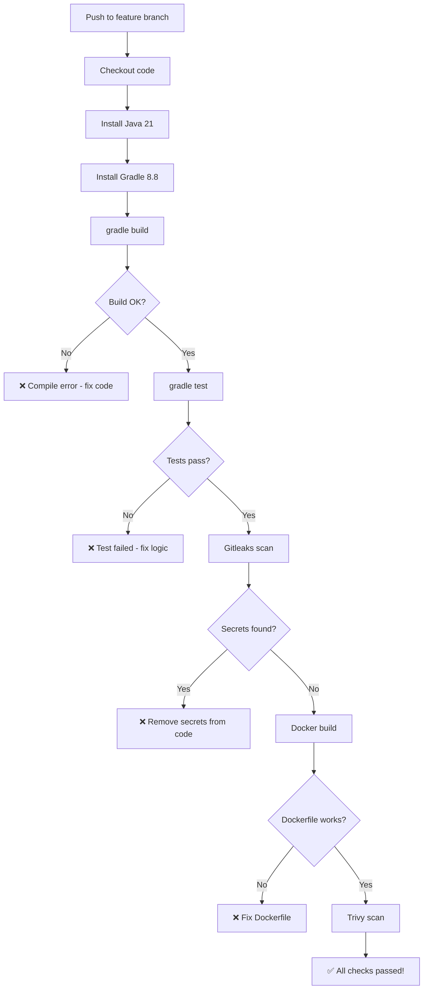

# 05 - CI Pipeline (ci.yml) Line by Line

---

## What is the CI Pipeline?

The CI (Continuous Integration) pipeline runs on **every push to a feature branch** and on **every Pull Request**. Its job is to verify the code works before it gets merged.

**It does NOT deploy anything.** It only checks.

---

## When Does It Trigger?

```yaml
on:
  push:
    branches-ignore:        # Runs on ALL branches EXCEPT these
      - main
      - dev
      - test
      - prod
  pull_request:
    branches:               # Also runs when PR targets these branches
      - main
      - dev
      - test
      - prod
```

**Translation:**
- Push to `feature/add-login` → CI runs ✅
- Push to `bugfix/fix-crash` → CI runs ✅
- Push to `main` → CI does NOT run (CD runs instead)
- Open PR from `feature/add-login` to `main` → CI runs ✅

---

## The Full ci.yml (Annotated)

```yaml
name: CI Pipeline - Build & Test    # Name shown in GitHub Actions UI

on:
  push:
    branches-ignore:
      - main
      - dev
      - test
      - prod
  pull_request:
    branches:
      - main
      - dev
      - test
      - prod

jobs:
  build-and-test:                    # Job name (can be anything)
    name: Build, Test & Scan         # Display name in UI
    runs-on: ubuntu-latest           # Use Ubuntu VM (free, Linux)
    
    steps:
      # ─────────────────────────────────────────
      # STEP 1: Get the code
      # ─────────────────────────────────────────
      - name: Checkout code
        uses: actions/checkout@v4    # Official GitHub action to clone your repo
        with:
          fetch-depth: 0             # Get full history (needed for SonarCloud)

      # ─────────────────────────────────────────
      # STEP 2: Install Java
      # ─────────────────────────────────────────
      - name: Set up JDK 21
        uses: actions/setup-java@v4  # Installs Java on the runner
        with:
          java-version: '21'         # Which version
          distribution: 'temurin'    # Which JDK distribution (Eclipse Temurin)

      # ─────────────────────────────────────────
      # STEP 3: Install Gradle
      # ─────────────────────────────────────────
      - name: Setup Gradle
        uses: gradle/actions/setup-gradle@v3
        with:
          gradle-version: '8.8'      # Pin version (9.x is incompatible)

      # ─────────────────────────────────────────
      # STEP 4: Build the application
      # ─────────────────────────────────────────
      - name: Build application
        run: gradle build --no-daemon
        # --no-daemon: don't keep Gradle running in background (CI is ephemeral)
        # This compiles Java code and creates a JAR

      # ─────────────────────────────────────────
      # STEP 5: Run tests
      # ─────────────────────────────────────────
      - name: Run tests
        run: gradle test --no-daemon
        # Runs all @Test methods in src/test/
        # If any test fails → this step fails → pipeline fails

      # ─────────────────────────────────────────
      # STEP 6: Code coverage
      # ─────────────────────────────────────────
      - name: Generate test coverage report
        run: gradle jacocoTestReport --no-daemon
        # Creates XML/HTML report showing what % of code is covered by tests

      # ─────────────────────────────────────────
      # STEP 7: Secret scanning
      # ─────────────────────────────────────────
      - name: Gitleaks - Secret Scanning
        uses: gitleaks/gitleaks-action@v2
        env:
          GITHUB_TOKEN: ${{ secrets.GITHUB_TOKEN }}
          # GITHUB_TOKEN is auto-provided, no need to create it
        # Scans ALL files + git history for:
        # - API keys
        # - Passwords
        # - AWS credentials
        # - Private keys
        # If found → pipeline FAILS

      # ─────────────────────────────────────────
      # STEP 8: Build Docker image (TEST ONLY)
      # ─────────────────────────────────────────
      - name: Build Docker image (test)
        run: docker build -t spring-microservice:test .
        # Builds the image to verify Dockerfile works
        # Does NOT push it anywhere — just testing

      # ─────────────────────────────────────────
      # STEP 9: Vulnerability scan
      # ─────────────────────────────────────────
      - name: Trivy - Image Vulnerability Scan
        uses: aquasecurity/trivy-action@master
        with:
          image-ref: 'spring-microservice:test'   # Scan the image we just built
          format: 'table'                         # Output as table
          exit-code: '0'                          # 0 = report only, 1 = fail on issues
          ignore-unfixed: true                    # Ignore CVEs with no fix available
          severity: 'CRITICAL'                    # Only show CRITICAL issues
```

---

## Flow Diagram



---

## What Each Step Produces

| Step | Produces | If it fails... |
|------|----------|---------------|
| Checkout | Code on runner disk | Repo access issue |
| Set up JDK | Java available in PATH | Wrong version/distribution |
| Setup Gradle | Gradle available in PATH | Version mismatch |
| Build | Compiled classes + JAR | Syntax error or dependency issue |
| Test | Test results | A test assertion failed |
| JaCoCo | Coverage report (XML) | Never fails on its own |
| Gitleaks | Pass/fail | Found a secret in code/history |
| Docker build | Docker image (local only) | Dockerfile syntax or missing files |
| Trivy | Vulnerability report | CRITICAL CVE found (if exit-code: 1) |
