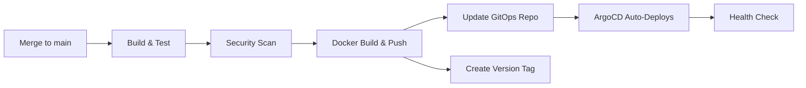
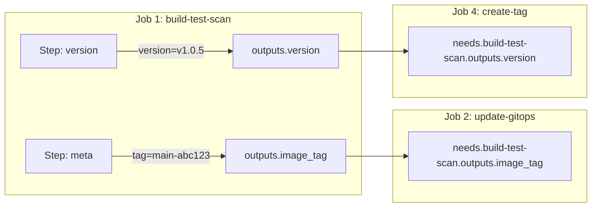
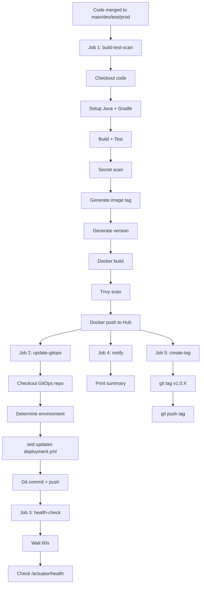

# 06 - CD Pipeline (cd.yml) Line by Line

This document explains every single line of our **Continuous Deployment** pipeline. This is the file that takes your tested code and actually puts it into production.

---

## 📍 Where is this file?

```
spring-microservice-cicd/
└── .github/
    └── workflows/
        └── cd.yml     ← THIS FILE
```

---

## 🎯 What Does the CD Pipeline Do?

When code is merged to `main`, `dev`, `test`, or `prod` branches, this pipeline:

1. ✅ Builds the application
2. ✅ Runs tests
3. ✅ Scans for secrets and vulnerabilities
4. ✅ Builds a Docker image
5. ✅ Pushes the image to Docker Hub
6. ✅ Updates the GitOps repo with the new image tag
7. ✅ Creates a version tag (v1.0.0, v1.0.1, etc.)
8. ✅ Runs a health check
9. ✅ Prints a summary



---

## 📄 The Complete cd.yml - Line by Line

### Pipeline Name and Trigger

```yaml
name: CD Pipeline - Build, Push & Deploy
```
> **What:** Gives this pipeline a human-readable name that shows up in the GitHub Actions tab.

```yaml
on:
  push:
    branches:
      - main
      - dev
      - test
      - prod
```
> **What:** This pipeline triggers when code is pushed (merged) to any of these branches.  
> **Why:** We only deploy from protected branches. Feature branches use the CI pipeline instead.  
> **Key difference from CI:** CI runs on feature branches and PRs. CD runs on merge to main/dev/test/prod.

---

### The `env` Block (Global Environment Variables)

```yaml
env:
  DOCKER_IMAGE: shwetang95/spring-microservice
  GITOPS_REPO: Shway95/spring-microservice-gitops
```

> **What:** These are environment variables available to ALL jobs in this pipeline.  
> **Why use `env`?** Instead of hardcoding these values in 5 different places, we define them once at the top. If we ever change our Docker Hub username or repo name, we only update it here.

| Variable | Value | Purpose |
|----------|-------|---------|
| `DOCKER_IMAGE` | `shwetang95/spring-microservice` | The full Docker Hub image name (username/image-name) |
| `GITOPS_REPO` | `Shway95/spring-microservice-gitops` | The GitHub repo that holds our Kubernetes manifests |

---

### Job 1: Build, Test & Scan

```yaml
jobs:
  build-test-scan:
    name: Build, Test & Security Scan
    runs-on: ubuntu-latest
```
> **What:** Defines the first job. It runs on a fresh Ubuntu virtual machine provided by GitHub.

---

#### Outputs - How Jobs Share Data

```yaml
    outputs:
      image_tag: ${{ steps.meta.outputs.tag }}
      version: ${{ steps.version.outputs.version }}
```

> **What:** `outputs` lets this job pass data to OTHER jobs that run later.  
> **Why:** Jobs run on different machines! Job 2 (update-gitops) needs to know what image tag Job 1 created. Without outputs, there's no way to share that information.  
> **How it works:**
> - Step `meta` generates a tag like `main-bc013c3`
> - Step `version` generates a version like `v1.0.5`
> - These values are stored as job outputs
> - Other jobs access them with: `${{ needs.build-test-scan.outputs.image_tag }}`



---

#### Steps: Checkout, Java, Gradle

```yaml
    steps:
      - name: Checkout code
        uses: actions/checkout@v4
        with:
          fetch-depth: 0
```
> **What:** Downloads your code into the runner machine.  
> **`fetch-depth: 0`:** Downloads the FULL git history (all commits and tags). We need this to find the latest version tag for auto-versioning.

```yaml
      - name: Set up JDK 21
        uses: actions/setup-java@v4
        with:
          java-version: '21'
          distribution: 'temurin'
```
> **What:** Installs Java 21 (Temurin distribution) on the runner. Our Spring Boot app needs Java to compile.

```yaml
      - name: Setup Gradle
        uses: gradle/actions/setup-gradle@v3
        with:
          gradle-version: '8.8'
```
> **What:** Installs Gradle 8.8 (our build tool).  
> **Why pin to 8.8?** Gradle 9.x introduced breaking changes. Pinning ensures consistent builds.  
> **Why not `./gradlew`?** We had issues with the Gradle wrapper not being found in the runner. Using the setup-gradle action is more reliable.

```yaml
      - name: Build application
        run: gradle build --no-daemon

      - name: Run tests
        run: gradle test --no-daemon

      - name: Generate test coverage
        run: gradle jacocoTestReport --no-daemon
```
> **What:** Compiles the app, runs all unit tests, and generates a code coverage report.  
> **`--no-daemon`:** Don't keep a background Gradle process running. CI runners are ephemeral (disposable), so there's no benefit to keeping the daemon alive.

---

#### Step: Secret Scanning

```yaml
      - name: Gitleaks - Secret Scanning
        uses: gitleaks/gitleaks-action@v2
        env:
          GITHUB_TOKEN: ${{ secrets.GITHUB_TOKEN }}
```
> **What:** Scans your code for accidentally committed secrets (API keys, passwords, tokens).  
> **Why:** If someone commits a database password, this catches it before it reaches Docker Hub.

---

#### Step: Generate Image Tag

```yaml
      - name: Generate image tag
        id: meta
        run: |
          BRANCH=${GITHUB_REF#refs/heads/}
          SHORT_SHA=$(git rev-parse --short HEAD)
          TAG="${BRANCH}-${SHORT_SHA}"
          echo "tag=$TAG" >> $GITHUB_OUTPUT
          echo "Image tag: $TAG"
```

> **Line-by-line breakdown:**

| Line | What it does |
|------|-------------|
| `id: meta` | Gives this step a name so other steps can reference its outputs |
| `BRANCH=${GITHUB_REF#refs/heads/}` | Extracts just the branch name from `refs/heads/main` → `main` |
| `SHORT_SHA=$(git rev-parse --short HEAD)` | Gets the first 7 characters of the commit hash → `bc013c3` |
| `TAG="${BRANCH}-${SHORT_SHA}"` | Combines them → `main-bc013c3` |
| `echo "tag=$TAG" >> $GITHUB_OUTPUT` | Saves the tag so other steps/jobs can use it |

> **Result:** Each image gets a unique, traceable tag like `main-bc013c3` that tells you which branch and commit produced it.

---

#### Step: Generate Semantic Version (Auto-Versioning)

```yaml
      - name: Generate semantic version
        id: version
        run: |
          # Get the latest tag (semantic version)
          LATEST_TAG=$(git tag -l "v*" --sort=-v:refname | head -n 1)
          if [ -z "$LATEST_TAG" ]; then
            # No tags yet, start at v1.0.0
            NEW_VERSION="v1.0.0"
          else
            # Increment patch version (v1.2.3 -> v1.2.4)
            VERSION=${LATEST_TAG#v}
            MAJOR=$(echo $VERSION | cut -d. -f1)
            MINOR=$(echo $VERSION | cut -d. -f2)
            PATCH=$(echo $VERSION | cut -d. -f3)
            PATCH=$((PATCH + 1))
            NEW_VERSION="v${MAJOR}.${MINOR}.${PATCH}"
          fi
          echo "version=$NEW_VERSION" >> $GITHUB_OUTPUT
          echo "🏷️ New version: $NEW_VERSION"
```

> **Line-by-line breakdown:**

| Line | What it does |
|------|-------------|
| `git tag -l "v*" --sort=-v:refname` | Lists all tags starting with "v", sorted newest first |
| `head -n 1` | Takes only the first one (latest) |
| `if [ -z "$LATEST_TAG" ]` | If no tags exist yet... |
| `NEW_VERSION="v1.0.0"` | ...start at version 1.0.0 |
| `VERSION=${LATEST_TAG#v}` | Strips the "v" prefix: `v1.2.3` → `1.2.3` |
| `cut -d. -f1` | Extracts MAJOR (1) |
| `cut -d. -f2` | Extracts MINOR (2) |
| `cut -d. -f3` | Extracts PATCH (3) |
| `PATCH=$((PATCH + 1))` | Increments PATCH: 3 → 4 |
| `NEW_VERSION="v${MAJOR}.${MINOR}.${PATCH}"` | Reassembles: `v1.2.4` |

> **Example flow:**
> - First deploy ever → `v1.0.0`
> - Next deploy → `v1.0.1`
> - Next → `v1.0.2`
> - ...and so on automatically!

---

#### Steps: Docker Build, Scan, Push

```yaml
      - name: Build Docker image
        run: docker build -t ${{ env.DOCKER_IMAGE }}:${{ steps.meta.outputs.tag }} .
```
> **What:** Builds the Docker image with the tag we generated.  
> **Example:** `docker build -t shwetang95/spring-microservice:main-bc013c3 .`

```yaml
      - name: Trivy - Image Vulnerability Scan
        uses: aquasecurity/trivy-action@master
        with:
          image-ref: '${{ env.DOCKER_IMAGE }}:${{ steps.meta.outputs.tag }}'
          format: 'table'
          exit-code: '0'
          ignore-unfixed: true
          severity: 'CRITICAL'
```
> **What:** Scans the Docker image for known security vulnerabilities (CVEs).  
> **`exit-code: '0'`:** Don't fail the pipeline even if vulnerabilities are found. We log them but continue.  
> **`severity: 'CRITICAL'`:** Only report CRITICAL vulnerabilities (not medium/low).  
> **`ignore-unfixed: true`:** Skip vulnerabilities that don't have a fix available yet.

```yaml
      - name: Login to Docker Hub
        uses: docker/login-action@v3
        with:
          username: ${{ secrets.DOCKERHUB_USERNAME }}
          password: ${{ secrets.DOCKERHUB_TOKEN }}
```
> **What:** Authenticates with Docker Hub so we can push images.  
> **Secrets:** These come from your GitHub repo's Settings → Secrets page.

```yaml
      - name: Push Docker image
        run: |
          docker push ${{ env.DOCKER_IMAGE }}:${{ steps.meta.outputs.tag }}
          docker tag ${{ env.DOCKER_IMAGE }}:${{ steps.meta.outputs.tag }} ${{ env.DOCKER_IMAGE }}:latest
          docker push ${{ env.DOCKER_IMAGE }}:latest
```
> **What:** Pushes two tags to Docker Hub:
> 1. The specific tag (e.g., `main-bc013c3`) — for traceability
> 2. The `latest` tag — always points to the most recent image

---

### Job 2: Update GitOps Repo

```yaml
  update-gitops:
    name: Update GitOps Repo
    needs: build-test-scan
    runs-on: ubuntu-latest
```
> **`needs: build-test-scan`:** This job only runs AFTER job 1 succeeds. If the build or tests fail, we don't update the deployment.

```yaml
    steps:
      - name: Checkout GitOps repo
        uses: actions/checkout@v4
        with:
          repository: ${{ env.GITOPS_REPO }}
          token: ${{ secrets.GITOPS_TOKEN }}
          path: gitops
```
> **What:** Checks out a DIFFERENT repository (the GitOps repo) into a folder called `gitops`.  
> **`token: GITOPS_TOKEN`:** We need a Personal Access Token because GITHUB_TOKEN can only access the current repo.

```yaml
      - name: Determine environment
        id: env
        run: |
          BRANCH=${GITHUB_REF#refs/heads/}
          if [ "$BRANCH" = "prod" ]; then
            echo "env=prod" >> $GITHUB_OUTPUT
          elif [ "$BRANCH" = "test" ]; then
            echo "env=test" >> $GITHUB_OUTPUT
          else
            echo "env=dev" >> $GITHUB_OUTPUT
          fi
```
> **What:** Maps the branch to an environment folder:  
> - `prod` branch → deploys to `prod/` folder  
> - `test` branch → deploys to `test/` folder  
> - `main` or `dev` branch → deploys to `dev/` folder

---

#### The `sed` Command Explained

```yaml
      - name: Update image tag in GitOps repo
        run: |
          cd gitops/${{ steps.env.outputs.env }}
          sed -i "s|image:.*|image: ${{ env.DOCKER_IMAGE }}:${{ needs.build-test-scan.outputs.image_tag }}|" deployment.yml
          echo "Updated image tag to: ${{ needs.build-test-scan.outputs.image_tag }}"
```

> **This is the most important step!** Let's break down the `sed` command:

```
sed -i "s|image:.*|image: shwetang95/spring-microservice:main-bc013c3|" deployment.yml
```

| Part | Meaning |
|------|---------|
| `sed` | Stream editor - a tool to find & replace text in files |
| `-i` | Edit the file **in-place** (save changes directly to the file) |
| `s` | Substitute (find and replace) |
| `\|` | Delimiter (using `\|` instead of `/` because our image path has `/`) |
| `image:.*` | **Find:** any line containing `image:` followed by anything (`.*`) |
| `image: shwetang95/spring-microservice:main-bc013c3` | **Replace with:** the new full image path with new tag |
| `deployment.yml` | The file to edit |

> **Before sed runs:**
> ```yaml
> image: shwetang95/spring-microservice:main-abc1234   ← old tag
> ```
> **After sed runs:**
> ```yaml
> image: shwetang95/spring-microservice:main-bc013c3   ← new tag!
> ```

---

#### Commit and Push the Change

```yaml
      - name: Commit and push
        run: |
          cd gitops
          git config user.name "github-actions[bot]"
          git config user.email "github-actions[bot]@users.noreply.github.com"
          git add .
          git commit -m "Update ${{ steps.env.outputs.env }} image to ${{ needs.build-test-scan.outputs.image_tag }}"
          git push
```
> **What:** Commits the updated `deployment.yml` and pushes it to the GitOps repo.  
> **Why `github-actions[bot]`?** This identifies the commit as automated (not a human).  
> **What happens next?** ArgoCD is watching this repo. It sees the change and automatically deploys the new image to Kubernetes!

---

### Job 3: Health Check

```yaml
  health-check:
    name: Post-Deploy Health Check
    needs: update-gitops
    runs-on: ubuntu-latest
    steps:
      - name: Wait for ArgoCD sync
        run: sleep 60

      - name: Health check
        run: |
          echo "Waiting for ArgoCD to sync and deploy..."
          echo "curl -f http://your-app-url/actuator/health"
```
> **What:** Waits 60 seconds for ArgoCD to detect the change and deploy, then checks if the app is healthy.  
> **`sleep 60`:** ArgoCD polls every 3 minutes by default, but with auto-sync it's usually faster.

---

### Job 4: Pipeline Summary

```yaml
  notify:
    name: Pipeline Summary
    needs: [build-test-scan, update-gitops]
    runs-on: ubuntu-latest
    if: always()
```
> **`needs: [build-test-scan, update-gitops]`:** Waits for BOTH jobs.  
> **`if: always()`:** Runs even if previous jobs failed — so you always get a summary.

```yaml
    steps:
      - name: Print deployment summary
        run: |
          echo "=========================================="
          echo "  DEPLOYMENT SUMMARY"
          echo "=========================================="
          echo "Repository: ${{ github.repository }}"
          echo "Branch: ${{ github.ref_name }}"
          echo "Version: ${{ needs.build-test-scan.outputs.version }}"
          echo "Image Tag: ${{ needs.build-test-scan.outputs.image_tag }}"
          echo "Triggered by: ${{ github.actor }}"
          echo "Build: ${{ needs.build-test-scan.result }}"
          echo "GitOps Update: ${{ needs.update-gitops.result }}"
          echo "=========================================="
```
> **What:** Prints a nice summary showing what was deployed, by whom, and whether it succeeded.

---

### Job 5: Create Version Tag

```yaml
  create-tag:
    name: Create Version Tag
    needs: [build-test-scan, update-gitops]
    runs-on: ubuntu-latest
    if: success()
    permissions:
      contents: write
```

#### Why `permissions: contents: write`?

> **What:** Grants this job permission to push tags to the repository.  
> **Why is this needed?** The default `GITHUB_TOKEN` has **read-only** access to repo contents. Creating and pushing a git tag requires **write** access.  
> **Without this:** You'd get a `403 Forbidden` error when trying to push the tag.  
> **Security benefit:** We only grant write permissions to the specific job that needs it, not the entire pipeline.

```yaml
    steps:
      - name: Checkout code
        uses: actions/checkout@v4
        with:
          fetch-depth: 0

      - name: Create and push tag
        run: |
          VERSION="${{ needs.build-test-scan.outputs.version }}"
          git config user.name "github-actions[bot]"
          git config user.email "github-actions[bot]@users.noreply.github.com"
          git tag -a "$VERSION" -m "Release $VERSION - Branch: ${{ github.ref_name }}, SHA: ${{ github.sha }}"
          git push origin "$VERSION"
          echo "🏷️ Tagged: $VERSION"
```

| Line | What it does |
|------|-------------|
| `git tag -a "$VERSION"` | Creates an **annotated** tag (has metadata like message and author) |
| `-m "Release $VERSION..."` | The tag message with context about what triggered it |
| `git push origin "$VERSION"` | Pushes just the tag to GitHub (visible in Releases/Tags) |

---

## 🔄 Complete Pipeline Flow Diagram



---

## 🆚 CI vs CD - When Does Each Run?

| Scenario | CI Pipeline | CD Pipeline |
|----------|-------------|-------------|
| Push to `feature/xyz` | ✅ Runs | ❌ Doesn't run |
| Open a PR to `main` | ✅ Runs | ❌ Doesn't run |
| Merge PR to `main` | ❌ Doesn't run | ✅ Runs |
| Push to `prod` | ❌ Doesn't run | ✅ Runs |

---

## 📝 Key Takeaways

1. **`env` block** = Global variables shared across all jobs
2. **`outputs`** = How one job passes data to another job
3. **`needs`** = Job dependency (wait for previous job)
4. **`sed`** = The magic command that updates the image tag in GitOps
5. **`permissions: contents: write`** = Required for pushing tags
6. **Auto-versioning** = Finds latest tag, increments patch number automatically
