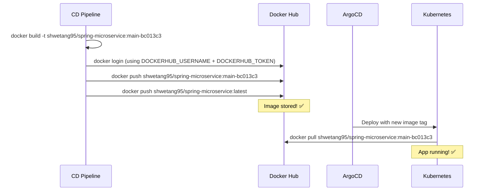

# 07 - Docker Hub Setup

This document explains what Docker Hub is, how to set it up, and how our pipeline uses it to store container images.

---

## 🎯 What is Docker Hub?

Docker Hub is like **GitHub but for Docker images**. Just like GitHub stores your code, Docker Hub stores your built application containers.

| Concept | GitHub | Docker Hub |
|---------|--------|------------|
| What's stored | Source code | Docker images |
| Address format | `username/repo-name` | `username/image-name:tag` |
| Access | git push/pull | docker push/pull |
| Visibility | Public/Private repos | Public/Private images |

> **Our Docker Hub image:** `shwetang95/spring-microservice`

---

## 📦 How Images Are Organized

Docker Hub images follow this naming format:

```
username/image-name:tag
```

**Example:**
```
shwetang95/spring-microservice:main-bc013c3
│           │                    │
│           │                    └── Tag (version identifier)
│           └── Image name (what the app is)
└── Username (who owns it)
```

### Tags We Use

| Tag | Meaning | Example |
|-----|---------|---------|
| `branch-sha` | Specific build from branch + commit | `main-bc013c3` |
| `latest` | Most recent build (always updated) | `latest` |

> **Think of tags like versions.** The image name stays the same, but tags let you have multiple versions stored simultaneously.

---

## 🔧 Step-by-Step: Create a Docker Hub Account

### Step 1: Go to Docker Hub

1. Open your browser
2. Navigate to: **https://hub.docker.com**
3. Click **"Sign Up"** (top right)

### Step 2: Create Your Account

1. Enter your **username** (this becomes part of your image name!)
   - Example: `shwetang95` → images will be `shwetang95/something`
2. Enter your **email**
3. Enter a **password**
4. Complete the CAPTCHA
5. Click **"Sign Up"**
6. Verify your email

### Step 3: Verify Your Account

1. Check your email inbox
2. Click the verification link
3. You're now logged in to Docker Hub!

---

## 🔑 Step-by-Step: Create an Access Token

Your CI/CD pipeline needs a token (not your password) to push images.

### Step 1: Go to Security Settings

1. Click your **profile icon** (top right)
2. Click **"Account Settings"**
3. Click **"Security"** in the left sidebar
4. Click **"Personal access tokens"**

### Step 2: Create New Token

1. Click **"Generate New Token"**
2. Fill in the form:
   - **Token Description:** `github-actions-cd` (or any name you'll remember)
   - **Access permissions:** Select **"Read & Write"**

### Step 3: Understand Permissions

| Permission | What it allows | Do we need it? |
|------------|---------------|----------------|
| Read only | Pull images | ❌ Not enough |
| Read & Write | Pull AND push images | ✅ YES - we need this |
| Read, Write & Delete | All of above + delete images | ❌ Too much access |

> **We choose "Read & Write"** because our pipeline needs to:
> - **Push** new images after building them
> - **Read** is implicit (you can always pull your own images)

### Step 4: Copy and Save the Token

1. Click **"Generate"**
2. **IMPORTANT:** Copy the token immediately!
3. You will NEVER see this token again after closing the dialog
4. Save it somewhere temporarily (you'll add it to GitHub Secrets next)

> ⚠️ **If you lose the token, you'll need to create a new one.** Docker Hub doesn't show tokens again after creation.

---

## 📥 How to Verify Your Image Was Pushed

After your CD pipeline runs, verify the image exists:

### Method 1: Docker Hub Web UI

1. Go to **https://hub.docker.com**
2. Log in to your account
3. Click **"Repositories"** in the top navigation
4. Find your repository: `spring-microservice`
5. Click on it to see all tags

You should see something like:

```
Tags:
  main-bc013c3    Last pushed 2 minutes ago    156 MB
  latest          Last pushed 2 minutes ago    156 MB
  main-abc1234    Last pushed 1 day ago        155 MB
```

### Method 2: Command Line

```bash
# Pull the image (proves it exists)
docker pull shwetang95/spring-microservice:latest

# List tags via Docker Hub API
curl -s https://hub.docker.com/v2/repositories/shwetang95/spring-microservice/tags/ | python -m json.tool
```

---

## 🔗 How This Connects to the Pipeline



---

## 🔐 Secrets Needed for Docker Hub

These go in your GitHub repo's **Settings → Secrets and variables → Actions**:

| Secret Name | Value | Example |
|-------------|-------|---------|
| `DOCKERHUB_USERNAME` | Your Docker Hub username | `shwetang95` |
| `DOCKERHUB_TOKEN` | The access token you generated | `dckr_pat_xxxxx...` |

> **Never use your Docker Hub password!** Always use an access token. Tokens can be revoked independently if compromised.

---

## ❗ Common Issues

| Problem | Cause | Fix |
|---------|-------|-----|
| `denied: requested access to the resource is denied` | Wrong username or token | Double-check `DOCKERHUB_USERNAME` matches exactly |
| `unauthorized: authentication required` | Token expired or deleted | Create a new token in Docker Hub |
| Image not showing in Docker Hub | Wrong image name | Ensure `DOCKER_IMAGE` env matches your Docker Hub repo |
| Can't push | Token has Read-only permission | Create a new token with Read & Write |

---

## 📝 Key Takeaways

1. Docker Hub stores your container images (like GitHub for code)
2. Image format: `username/image-name:tag`
3. Create an access token with **Read & Write** permissions
4. Never share your token — store it in GitHub Secrets
5. Your pipeline pushes two tags: a specific one (traceable) and `latest` (convenient)
