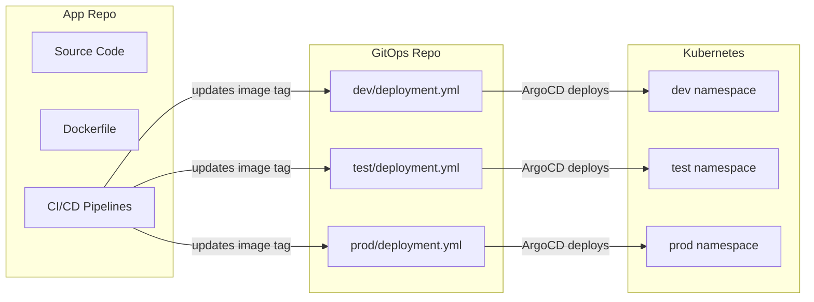
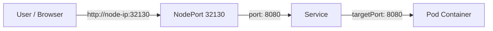
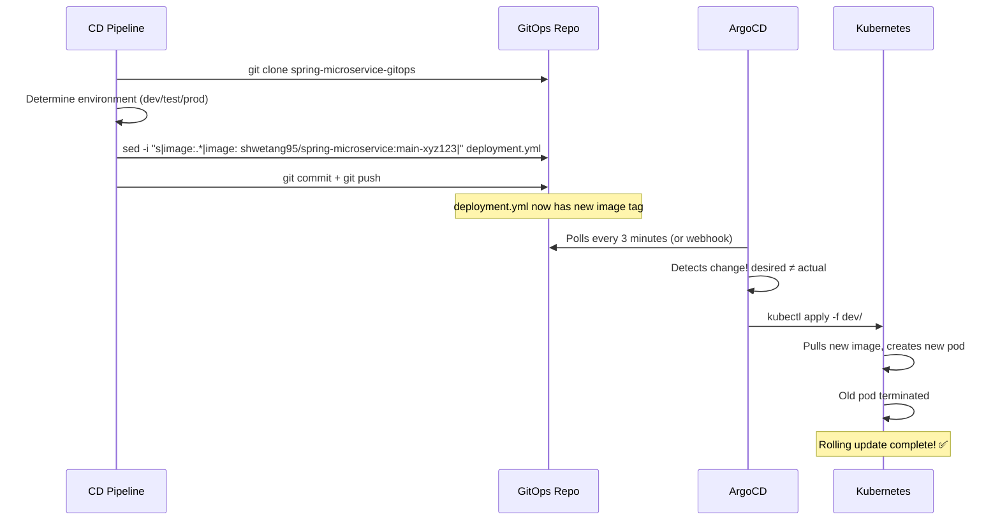
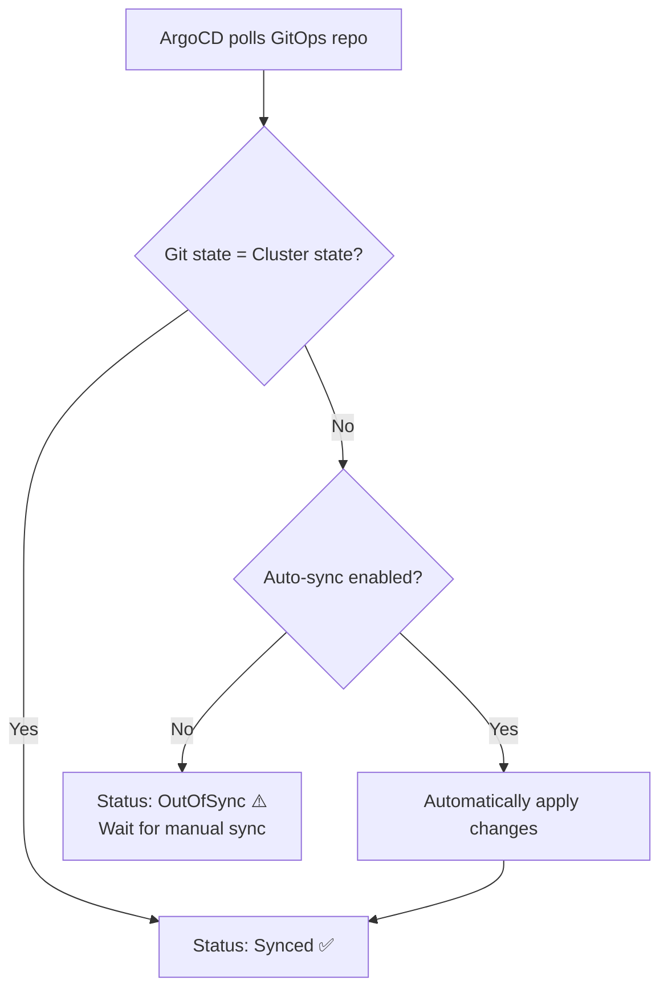

# 08 - GitOps Repository Explained

This document explains what GitOps is, why we use a separate repository for Kubernetes manifests, and breaks down every file line by line.

---

## 🎯 What is GitOps?

**GitOps = Using Git as the single source of truth for your infrastructure.**

In simple terms:
- You describe what your deployment should look like in YAML files
- You store those YAML files in a Git repository
- A tool (ArgoCD) watches that repo
- When the YAML changes, ArgoCD automatically updates your live deployment

> **Analogy:** Think of it like a thermostat. You set the desired temperature (YAML files). The thermostat (ArgoCD) continuously checks if the actual temperature matches. If someone opens a window (manual change on cluster), the thermostat corrects it back.

---

## 🤔 Why a Separate Repo?

We have TWO repositories:

| Repository | Purpose | Changes by |
|-----------|---------|------------|
| `spring-microservice-cicd` | Application code + CI/CD pipelines | Developers |
| `spring-microservice-gitops` | Kubernetes deployment files | CD pipeline (automated) |

**Why not put everything in one repo?**

1. **Separation of concerns** — App code and deployment config have different lifecycles
2. **Security** — ArgoCD only needs access to deployment files, not your source code
3. **Audit trail** — You can see exactly what changed in your deployment, separate from code changes
4. **Multi-environment** — One GitOps repo can manage dev, test, and prod independently
5. **Rollback** — Reverting a deployment is just reverting a commit in the GitOps repo



---

## 📁 Repository Structure

```
spring-microservice-gitops/
├── dev/                        ← Development environment
│   ├── deployment.yml          ← How to run the app
│   ├── service.yml             ← How to expose the app
│   ├── configmap.yml           ← Non-secret configuration
│   └── secret.yml              ← Secret configuration (encoded)
├── test/                       ← Testing environment
│   ├── deployment.yml
│   ├── service.yml
│   ├── configmap.yml
│   └── secret.yml
└── prod/                       ← Production environment
    ├── deployment.yml
    ├── service.yml
    ├── configmap.yml
    └── secret.yml
```

> Each environment has the **same 4 files** but with **different values** (different replicas, different database hosts, different log levels, etc.)

---

## 📄 deployment.yml - Line by Line

This is the most important file. It tells Kubernetes HOW to run your application.

```yaml
apiVersion: apps/v1
```
> **What:** Which version of the Kubernetes API we're using for Deployments.  
> **Think of it like:** `#include <apps/v1>` — we're using the "apps" API, version 1.

```yaml
kind: Deployment
```
> **What:** The type of resource we're creating.  
> **A Deployment manages pods** — it ensures the right number of copies are running and handles updates.

```yaml
metadata:
  name: spring-microservice
  namespace: dev
  labels:
    app: spring-microservice
    env: dev
```
> **`name`:** The unique name of this Deployment within the namespace.  
> **`namespace: dev`:** Which namespace to create this in (dev, test, or prod).  
> **`labels`:** Key-value tags for organizing and selecting resources. Think of them like hashtags.

```yaml
spec:
  replicas: 1
```
> **What:** How many copies (pods) of your app to run.  
> **`1`** for dev (save resources), **`2-3`** for prod (high availability).  
> If a pod crashes, Kubernetes automatically creates a new one to maintain the count.

```yaml
  selector:
    matchLabels:
      app: spring-microservice
```
> **What:** Tells the Deployment which pods it "owns."  
> **Rule:** This must match the `labels` in the pod template below.

```yaml
  template:
    metadata:
      labels:
        app: spring-microservice
        env: dev
```
> **What:** Template for creating pods. Every pod created by this Deployment gets these labels.

```yaml
    spec:
      containers:
        - name: app
          image: shwetang95/spring-microservice:main-bc013c3
```
> **`name: app`:** Name of the container inside the pod (a pod can have multiple containers).  
> **`image`:** The Docker image to pull from Docker Hub. **THIS is what the CD pipeline updates with `sed`!**

```yaml
          ports:
            - containerPort: 8080
```
> **What:** Declares that the container listens on port 8080. This is informational and for documentation.

```yaml
          envFrom:
            - configMapRef:
                name: spring-microservice-config
            - secretRef:
                name: spring-microservice-secrets
```
> **What:** Inject ALL key-value pairs from the ConfigMap and Secret as environment variables into the container.  
> **Result:** Your app can read `DB_HOST`, `API_KEY`, etc. using `System.getenv("DB_HOST")`.  
> **`envFrom` vs `env`:** `envFrom` injects everything from a source. `env` lets you pick individual variables.

```yaml
          livenessProbe:
            httpGet:
              path: /actuator/health
              port: 8080
            initialDelaySeconds: 30
            periodSeconds: 10
```
> **What:** "Is this container still alive?"  
> **How:** Kubernetes hits `/actuator/health` every 10 seconds.  
> **If it fails:** Kubernetes RESTARTS the container (kills and recreates it).  
> **`initialDelaySeconds: 30`:** Wait 30 seconds before first check (Spring Boot needs time to start).  
> **`periodSeconds: 10`:** Check every 10 seconds after that.

```yaml
          readinessProbe:
            httpGet:
              path: /actuator/health
              port: 8080
            initialDelaySeconds: 15
            periodSeconds: 5
```
> **What:** "Is this container ready to receive traffic?"  
> **How:** Same endpoint but checked more frequently (every 5 seconds).  
> **If it fails:** Kubernetes STOPS sending traffic to this pod (but doesn't kill it).  
> **Use case:** During startup, the app isn't ready yet. The readiness probe keeps traffic away until it is.

**Liveness vs Readiness:**
| | Liveness Probe | Readiness Probe |
|---|---|---|
| Question | "Are you alive?" | "Can you handle requests?" |
| On failure | Kill & restart container | Stop sending traffic |
| Check frequency | Every 10s | Every 5s |
| Initial delay | 30s | 15s |

```yaml
          resources:
            requests:
              memory: "256Mi"
              cpu: "250m"
            limits:
              memory: "512Mi"
              cpu: "500m"
```
> **`requests`:** Minimum resources guaranteed to this container. Kubernetes uses this for scheduling (deciding which node to place the pod on).  
> **`limits`:** Maximum resources the container can use. If it exceeds memory limit, it gets killed (OOMKilled).  
> **`250m` CPU** = 0.25 cores (quarter of a CPU).  
> **`256Mi` memory** = 256 megabytes.

---

## 📄 service.yml - Line by Line

A Service exposes your pods to network traffic. Without a Service, no one can reach your app.

```yaml
apiVersion: v1
kind: Service
```
> **What:** Creating a Service resource (networking layer).

```yaml
metadata:
  name: spring-microservice
  namespace: dev
  labels:
    app: spring-microservice
```
> **What:** Name and location of this Service.

```yaml
spec:
  type: NodePort
```
> **What:** The type of Service determines HOW it's accessible.

| Type | Access From | Use Case |
|------|-------------|----------|
| `ClusterIP` | Only inside the cluster | Internal microservices talking to each other |
| `NodePort` | Outside via Node's IP + port | Dev/test environments, direct access |
| `LoadBalancer` | Via cloud load balancer | Production on AWS/GCP/Azure |

> **We use `NodePort`** because we're running k3s on a single EC2 instance and want to access the app from our browser.

```yaml
  selector:
    app: spring-microservice
```
> **What:** Which pods this Service routes traffic to.  
> **Rule:** This must match the `labels` on your pods (from the Deployment template).  
> **How it works:** Any pod with label `app: spring-microservice` receives traffic from this Service.

```yaml
  ports:
    - port: 8080
      targetPort: 8080
      protocol: TCP
```
> **`port: 8080`:** The port the Service listens on (other services use this to talk to you).  
> **`targetPort: 8080`:** The port on the actual container to forward traffic to.  
> **`protocol: TCP`:** Use TCP (HTTP runs over TCP).



> **NodePort assignment:** Kubernetes automatically assigns a port in the range 30000-32767 if you don't specify `nodePort`. You can then access your app at `http://<node-ip>:<nodePort>`.

---

## 📄 configmap.yml - Line by Line

A ConfigMap stores non-secret configuration as key-value pairs.

```yaml
apiVersion: v1
kind: ConfigMap
metadata:
  name: spring-microservice-config
  namespace: dev
```
> **What:** Creating a ConfigMap named `spring-microservice-config` in the `dev` namespace.  
> **This name must match** the `configMapRef` in deployment.yml.

```yaml
data:
  SPRING_PROFILES_ACTIVE: "dev"
  SERVER_PORT: "8080"
  DB_HOST: "dev-db.internal"
  DB_PORT: "5432"
  DB_NAME: "microservice_dev"
  LOG_LEVEL: "DEBUG"
  API_BASE_URL: "https://dev-api.example.com"
```

| Key | What it configures | Dev value | Prod value (different!) |
|-----|-------------------|-----------|------------------------|
| `SPRING_PROFILES_ACTIVE` | Which Spring profile to use | `dev` | `prod` |
| `SERVER_PORT` | Port the app listens on | `8080` | `8080` |
| `DB_HOST` | Database server address | `dev-db.internal` | `prod-db.internal` |
| `DB_PORT` | Database port | `5432` | `5432` |
| `DB_NAME` | Database name | `microservice_dev` | `microservice_prod` |
| `LOG_LEVEL` | How verbose logging is | `DEBUG` | `WARN` |
| `API_BASE_URL` | External API endpoint | `dev-api.example.com` | `api.example.com` |

> **Why ConfigMap instead of hardcoding?**
> - Change config without rebuilding the Docker image
> - Different values per environment (dev vs prod)
> - Visible and auditable in Git

> **How the app reads these:** Spring Boot automatically picks up environment variables. `SPRING_PROFILES_ACTIVE=dev` activates the `application-dev.yml` profile.

---

## 📄 secret.yml - Line by Line

A Secret is like a ConfigMap but for sensitive data. Values are base64-encoded.

```yaml
apiVersion: v1
kind: Secret
metadata:
  name: spring-microservice-secrets
  namespace: dev
type: Opaque
```
> **`type: Opaque`:** Generic secret (as opposed to TLS certificates or Docker registry credentials).  
> **This name must match** the `secretRef` in deployment.yml.

```yaml
data:
  DB_USERNAME: ZGV2X3VzZXI=          # dev_user
  DB_PASSWORD: ZGV2X3Bhc3N3b3Jk      # dev_password
  API_KEY: ZGV2LWFwaS1rZXktMTIz      # dev-api-key-123
```

> **Values are base64-encoded**, NOT encrypted! Base64 is just encoding (like translating to another alphabet), not security.

### How to Encode/Decode Base64

**Encode (to put in secret.yml):**
```bash
# Linux/Mac
echo -n "dev_user" | base64
# Output: ZGV2X3VzZXI=

# Windows PowerShell
[Convert]::ToBase64String([Text.Encoding]::UTF8.GetBytes("dev_user"))
# Output: ZGV2X3VzZXI=
```

**Decode (to read the value):**
```bash
# Linux/Mac
echo "ZGV2X3VzZXI=" | base64 -d
# Output: dev_user

# Windows PowerShell
[Text.Encoding]::UTF8.GetString([Convert]::FromBase64String("ZGV2X3VzZXI="))
# Output: dev_user
```

> ⚠️ **Important:** Base64 is NOT encryption. Anyone with access to the secret.yml file can decode it. In production, use tools like **Sealed Secrets** or **External Secrets Operator** for real encryption.

---

## 🔄 How the CD Pipeline Updates the Image Tag

When the CD pipeline runs, it performs this sequence:



### What the `sed` command does:

**Before:**
```yaml
image: shwetang95/spring-microservice:main-abc1234
```

**The command:**
```bash
sed -i "s|image:.*|image: shwetang95/spring-microservice:main-xyz5678|" deployment.yml
```

**After:**
```yaml
image: shwetang95/spring-microservice:main-xyz5678
```

> The `sed` command finds the line containing `image:` and replaces everything after it with the new image path + tag.

---

## 👁️ How ArgoCD Watches This Repo

1. **ArgoCD is configured** to watch `https://github.com/Shway95/spring-microservice-gitops.git`
2. **It points to a specific path** (e.g., `dev/` folder)
3. **Every ~3 minutes**, ArgoCD compares:
   - **Desired state** (what's in Git) vs **Actual state** (what's running in the cluster)
4. **If they differ**, ArgoCD syncs:
   - With `automated: true` → syncs automatically
   - Without → shows "OutOfSync" and waits for you to click Sync



---

## 📝 Key Takeaways

1. **GitOps** = Git is the single source of truth for deployments
2. **Separate repo** = Clean separation between app code and deployment config
3. **deployment.yml** = Defines how your app runs (replicas, probes, resources)
4. **service.yml** = Defines how your app is accessed (networking)
5. **configmap.yml** = Non-secret config injected as environment variables
6. **secret.yml** = Sensitive values (base64-encoded, not encrypted!)
7. **sed command** = The bridge between CI/CD and GitOps (updates the image tag)
8. **ArgoCD** = Watches the repo and keeps the cluster in sync
