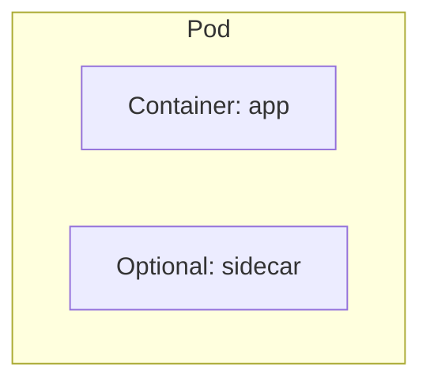
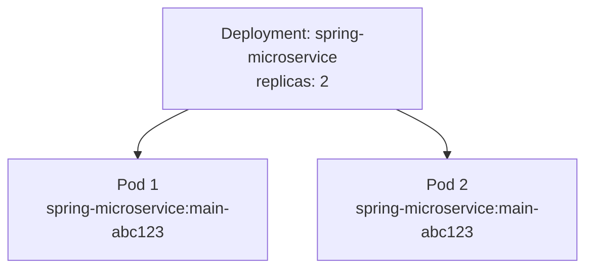
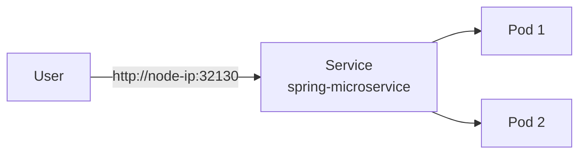
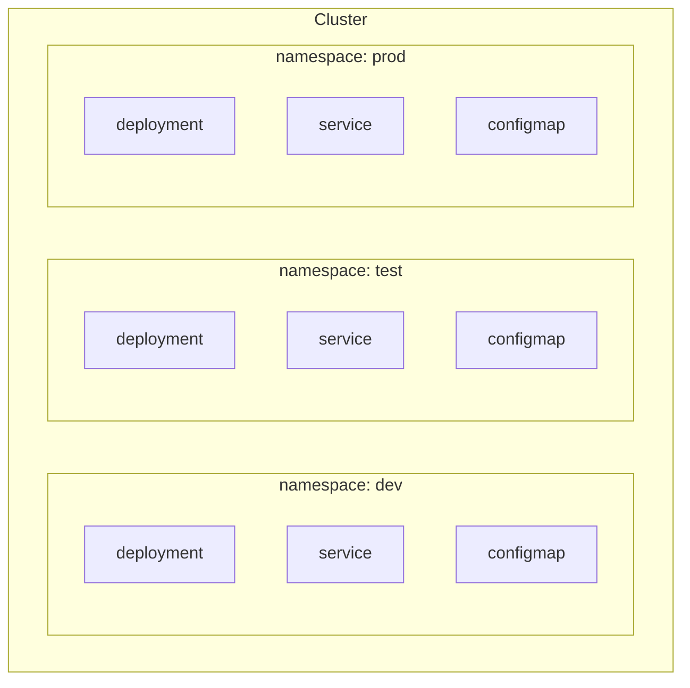
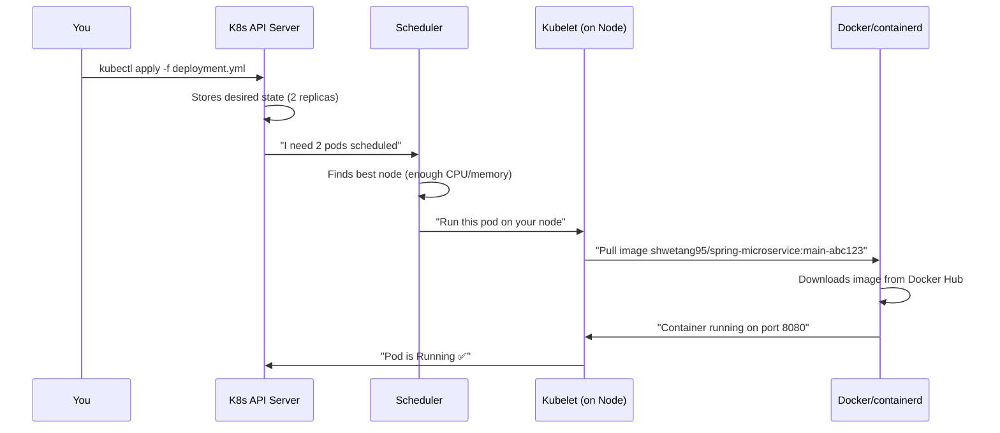
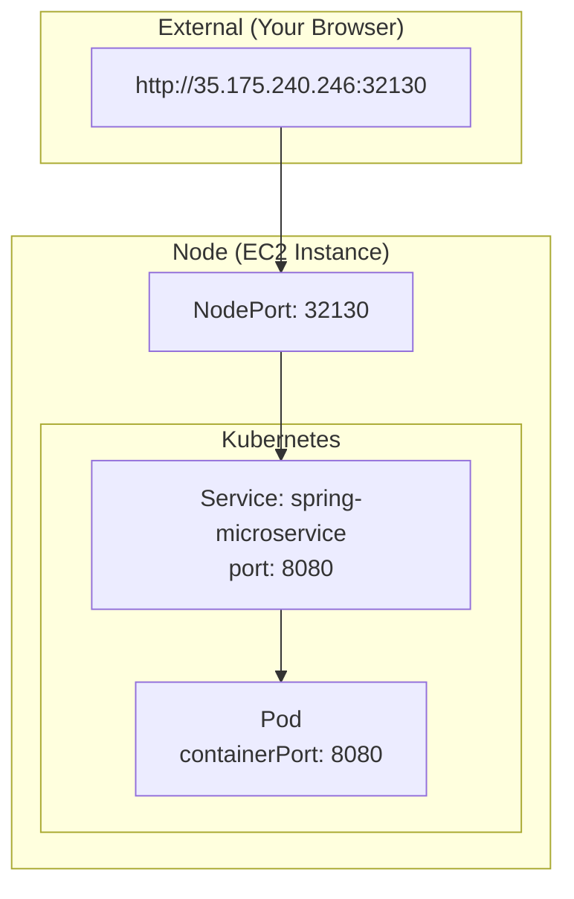
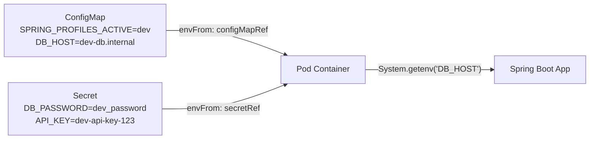
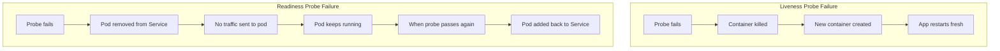

# 09 - Kubernetes (k3s) Setup & Concepts

This document explains Kubernetes from scratch, how k3s works, and all the core concepts you need to understand our deployment.

---

## 🎯 What is Kubernetes?

**Kubernetes (K8s) is a container orchestrator.** It manages your Docker containers in production.

### Simple Analogy

Think of Kubernetes as a **restaurant manager**:
- **You (the developer)** are the chef who creates dishes (Docker images)
- **Kubernetes** is the manager who:
  - Decides which table (server) gets which dish (container)
  - If a dish falls on the floor (container crashes), makes a new one immediately
  - If the restaurant gets busy (high traffic), spins up more chefs (replicas)
  - If a chef gets sick (node dies), redistributes work to other chefs

> **Without Kubernetes:** You manually SSH into servers, run `docker run`, and pray nothing crashes at 3 AM.  
> **With Kubernetes:** You describe what you want, and K8s makes it happen and keeps it that way.

---

## 🪶 What is k3s?

**k3s is a lightweight version of Kubernetes** made by Rancher Labs.

| | Full Kubernetes (k8s) | k3s |
|---|---|---|
| Install complexity | Complex (multiple components) | One command |
| Memory usage | ~1GB+ | ~512MB |
| Binary size | ~1GB | ~100MB |
| Best for | Large production clusters | Edge, IoT, dev/test, small prod |
| Features | Everything | Same, minus rarely-used features |

> **Why we use k3s:** We're running on a single AWS EC2 instance. Full Kubernetes would be overkill. k3s gives us the same API and features with much less resource usage.

---

## 🔧 How to Install k3s

### One Command Installation

```bash
curl -sfL https://get.k3s.io | sh -
```

That's it! This single command:
1. Downloads k3s binary
2. Installs it as a systemd service
3. Starts the Kubernetes cluster
4. Configures kubectl automatically

### Verify Installation

```bash
# Check k3s is running
sudo systemctl status k3s

# Check nodes (you should see one node: your server)
sudo kubectl get nodes

# Example output:
# NAME              STATUS   ROLES                  AGE   VERSION
# ip-172-31-25-10   Ready    control-plane,master   1h    v1.28.5+k3s1
```

### Where is the kubeconfig?

```bash
# k3s puts it here:
/etc/rancher/k3s/k3s.yaml

# kubectl is automatically configured, but if you need to specify:
export KUBECONFIG=/etc/rancher/k3s/k3s.yaml
```

---

## 🧱 Core Concepts

### Pod

The **smallest deployable unit** in Kubernetes. A pod wraps one or more containers.



- Usually one container per pod
- Containers in a pod share network (localhost) and storage
- Pods are **ephemeral** — they can be killed and recreated at any time
- **You never create pods directly.** You create Deployments, which create pods.

---

### Deployment

A Deployment **manages pods**. It ensures the desired number of replicas are always running.



**What a Deployment does:**
- Creates pods based on a template
- If a pod crashes → creates a new one
- If you update the image → does a rolling update (new pods up, old pods down)
- If you scale to 3 replicas → creates one more pod

---

### Service

A Service provides a **stable network endpoint** for your pods.

**Problem:** Pods get random IP addresses and can be killed/recreated at any time. How do you reliably connect to them?

**Solution:** A Service gives a stable address that routes to whatever pods are running.



---

### Namespace

A Namespace is a **virtual partition** within a cluster. It provides isolation.



> Resources in different namespaces are isolated. A ConfigMap in `dev` is invisible to pods in `prod`.

---

### ConfigMap

A ConfigMap stores **non-secret configuration** as key-value pairs. Injected into pods as environment variables.

```yaml
DB_HOST: "dev-db.internal"    ← available as env var in the container
LOG_LEVEL: "DEBUG"            ← change without rebuilding the image!
```

---

### Secret

A Secret stores **sensitive data** (passwords, tokens, keys). Similar to ConfigMap but:
- Values are base64-encoded
- Kubernetes restricts access (RBAC)
- Not shown in `kubectl describe` output by default

---

## 🏗️ Our Namespaces

We create three namespaces for our environments:

```bash
# Create namespaces
kubectl create namespace dev
kubectl create namespace test
kubectl create namespace prod
```

| Namespace | Purpose | Replicas | Log Level |
|-----------|---------|----------|-----------|
| `dev` | Development/testing | 1 | DEBUG |
| `test` | QA/Integration testing | 2 | INFO |
| `prod` | Production traffic | 3 | WARN |

---

## 🛠️ Useful kubectl Commands

### Viewing Resources

```bash
# List all pods in dev namespace
kubectl get pods -n dev

# List all resources in dev
kubectl get all -n dev

# Get detailed info about a pod
kubectl describe pod <pod-name> -n dev

# Get deployments
kubectl get deployments -n dev

# Get services (shows NodePort)
kubectl get svc -n dev
```

### Viewing Logs

```bash
# View pod logs (see what the app is printing)
kubectl logs <pod-name> -n dev

# Follow logs in real-time (like tail -f)
kubectl logs <pod-name> -n dev -f

# View logs from a crashed pod
kubectl logs <pod-name> -n dev --previous
```

### Debugging

```bash
# Why is a pod not starting?
kubectl describe pod <pod-name> -n dev

# Get into a running container (like SSH)
kubectl exec -it <pod-name> -n dev -- /bin/sh

# Check events (good for troubleshooting)
kubectl get events -n dev --sort-by='.lastTimestamp'
```

### Managing Deployments

```bash
# Restart a deployment (force new pods)
kubectl rollout restart deployment/spring-microservice -n dev

# Check rollout status
kubectl rollout status deployment/spring-microservice -n dev

# Scale up/down
kubectl scale deployment/spring-microservice --replicas=3 -n dev

# Undo last deployment
kubectl rollout undo deployment/spring-microservice -n dev
```

### Working with ConfigMaps and Secrets

```bash
# View ConfigMap values
kubectl get configmap spring-microservice-config -n dev -o yaml

# View Secret (values are base64 encoded)
kubectl get secret spring-microservice-secrets -n dev -o yaml

# Decode a specific secret value
kubectl get secret spring-microservice-secrets -n dev -o jsonpath="{.data.DB_PASSWORD}" | base64 -d
```

---

## 🔄 How a Pod Gets Created from a Deployment



**Step by step:**
1. You apply the deployment YAML
2. Kubernetes API stores it as the "desired state"
3. The scheduler picks a node with enough resources
4. The kubelet on that node pulls the Docker image
5. The container starts running
6. Health probes begin checking if it's ready

---

## 🌐 How a Service Exposes a Pod



**How traffic flows:**
1. User hits `http://35.175.240.246:32130`
2. Request hits the NodePort (32130) on the EC2 instance
3. NodePort forwards to the Service's port (8080)
4. Service uses label selector to find matching pods
5. Service forwards to the pod's targetPort (8080)
6. Your Spring Boot app handles the request

---

## 🔌 How ConfigMap/Secret Inject Environment Variables



**Inside the container, it looks like this:**
```bash
# If you exec into the pod and run env:
$ kubectl exec -it spring-microservice-xxx -- env

SPRING_PROFILES_ACTIVE=dev
SERVER_PORT=8080
DB_HOST=dev-db.internal
DB_PORT=5432
DB_NAME=microservice_dev
LOG_LEVEL=DEBUG
API_BASE_URL=https://dev-api.example.com
DB_USERNAME=dev_user        ← from Secret
DB_PASSWORD=dev_password    ← from Secret
API_KEY=dev-api-key-123     ← from Secret
```

> Your app doesn't know or care whether a variable came from a ConfigMap or Secret. It just reads environment variables normally.

---

## ❤️ Liveness vs Readiness Probes Explained

### Liveness Probe: "Are you alive?"

**Purpose:** Detect if the application has crashed or is stuck in a deadlock.

**If it fails:** Kubernetes **kills and restarts** the container.

**Example scenario:**
- Your app hits an infinite loop
- Memory leak causes the app to freeze
- The health endpoint stops responding
- Kubernetes detects this and restarts the pod

### Readiness Probe: "Can you handle traffic?"

**Purpose:** Detect if the application is ready to serve requests.

**If it fails:** Kubernetes **removes the pod from the Service** (no traffic sent to it) but does NOT restart it.

**Example scenario:**
- App is starting up and loading data into cache
- App is temporarily overloaded
- App lost database connection temporarily
- Kubernetes stops sending traffic until it recovers

### Visual Comparison



### Our Configuration

```yaml
livenessProbe:
  httpGet:
    path: /actuator/health      # Spring Boot health endpoint
    port: 8080
  initialDelaySeconds: 30       # Wait 30s before first check (startup time)
  periodSeconds: 10             # Check every 10 seconds

readinessProbe:
  httpGet:
    path: /actuator/health      # Same endpoint
    port: 8080
  initialDelaySeconds: 15       # Wait 15s (ready faster than alive)
  periodSeconds: 5              # Check more frequently (every 5s)
```

> **Why different delays?** Readiness starts checking sooner (15s) because we want to start routing traffic as soon as possible. Liveness waits longer (30s) because we don't want to kill a pod that's just slow to start.

---

## 📝 Key Takeaways

1. **Kubernetes** = Container orchestrator (manages your Docker containers)
2. **k3s** = Lightweight Kubernetes (one command install)
3. **Pod** = Smallest unit, wraps a container
4. **Deployment** = Manages pods (replicas, updates, self-healing)
5. **Service** = Stable network endpoint for pods
6. **Namespace** = Virtual partition (dev/test/prod isolation)
7. **ConfigMap** = Non-secret config → environment variables
8. **Secret** = Sensitive config → environment variables (base64 encoded)
9. **Liveness probe** = "Are you alive?" → restart if not
10. **Readiness probe** = "Can you handle traffic?" → stop traffic if not
