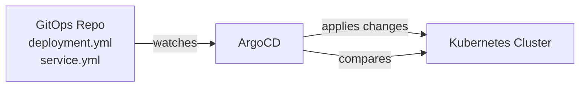
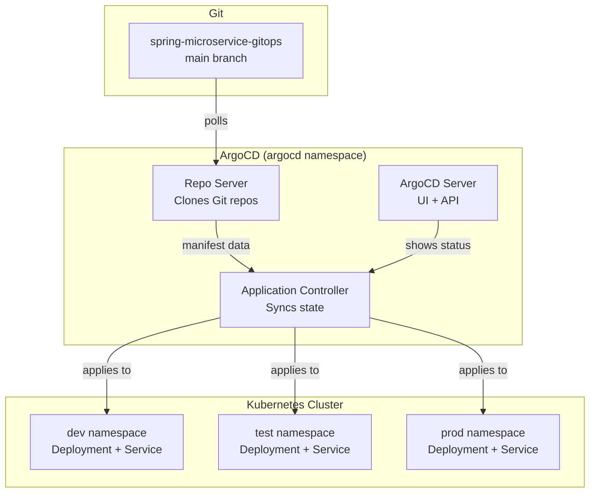

# 10 - ArgoCD Setup & Configuration

This document explains what ArgoCD is, how to install and configure it, and how it automatically deploys your application when the GitOps repo changes.

---

## 🎯 What is ArgoCD?

**ArgoCD is a GitOps continuous delivery tool for Kubernetes.**

In simple terms:
- ArgoCD watches a Git repository (your GitOps repo)
- It compares what's in Git (desired state) to what's running in the cluster (actual state)
- If they're different, it syncs the cluster to match Git

> **Analogy:** ArgoCD is like a robot that constantly checks a blueprint (Git) and makes sure the building (Kubernetes cluster) matches exactly. If someone moves a wall (manual `kubectl` change), the robot puts it back.



---

## 🔧 How to Install ArgoCD

### Step 1: Create Namespace

```bash
kubectl create namespace argocd
```

### Step 2: Install ArgoCD

```bash
kubectl apply -n argocd -f https://raw.githubusercontent.com/argoproj/argo-cd/stable/manifests/install.yaml
```

> This single command installs all ArgoCD components (API server, repo server, application controller, Redis, Dex).

### Step 3: Verify Installation

```bash
# Check all ArgoCD pods are running
kubectl get pods -n argocd

# Expected output (all should be Running):
# argocd-application-controller-0   1/1  Running
# argocd-dex-server-xxx             1/1  Running
# argocd-redis-xxx                  1/1  Running
# argocd-repo-server-xxx            1/1  Running
# argocd-server-xxx                 1/1  Running
```

---

## 🌐 How to Expose the ArgoCD UI (NodePort)

By default, the ArgoCD server is only accessible inside the cluster. We need to expose it.

### Option: Change to NodePort Service

```bash
# Delete the existing ClusterIP service
kubectl -n argocd delete svc argocd-server

# Recreate as NodePort
kubectl -n argocd expose deployment argocd-server \
  --type=NodePort \
  --name=argocd-server \
  --port=80 \
  --target-port=8080
```

### Find the Assigned Port

```bash
# Get the NodePort assigned by Kubernetes
kubectl -n argocd get svc argocd-server

# Output:
# NAME            TYPE       CLUSTER-IP    EXTERNAL-IP   PORT(S)        AGE
# argocd-server   NodePort   10.43.x.x    <none>        80:30080/TCP   1m
#                                                           ^^^^^
#                                                           This is your port!
```

> Your ArgoCD UI is now accessible at: `http://<your-ec2-public-ip>:30080`

---

## 🔑 How to Get the Initial Admin Password

ArgoCD generates a random password on install and stores it as a Kubernetes secret.

```bash
# Get the password
kubectl -n argocd get secret argocd-initial-admin-secret -o jsonpath="{.data.password}" | base64 -d

# Example output: XvKzqiOZtKDZCbLg
```

> **Save this password!** You'll need it to log into the UI and CLI.

---

## 🖥️ How to Login to the UI

### Web Browser

1. Open: `http://35.175.240.246:30080`
2. You'll see the ArgoCD login page
3. Enter credentials:
   - **Username:** `admin`
   - **Password:** (the password from the previous step)
4. Click "Sign In"

### CLI (optional)

```bash
# Install ArgoCD CLI (if needed)
curl -sSL -o argocd https://github.com/argoproj/argo-cd/releases/latest/download/argocd-linux-amd64
chmod +x argocd
sudo mv argocd /usr/local/bin/

# Login
argocd login 35.175.240.246:30080 --username admin --password <your-password> --insecure
```

---

## 📂 How to Add a Git Repository to ArgoCD

ArgoCD needs to know about your GitOps repository.

### Method 1: Kubernetes Secret (We Use This)

```yaml
apiVersion: v1
kind: Secret
metadata:
  name: spring-microservice-gitops
  namespace: argocd
  labels:
    argocd.argoproj.io/secret-type: repository
type: Opaque
stringData:
  type: git
  url: https://github.com/Shway95/spring-microservice-gitops.git
```

Apply it:
```bash
kubectl apply -f - <<EOF
apiVersion: v1
kind: Secret
metadata:
  name: spring-microservice-gitops
  namespace: argocd
  labels:
    argocd.argoproj.io/secret-type: repository
type: Opaque
stringData:
  type: git
  url: https://github.com/Shway95/spring-microservice-gitops.git
EOF
```

> **For private repos**, add `username` and `password` (PAT token) to `stringData`.

### Method 2: ArgoCD UI

1. Go to **Settings** (gear icon) → **Repositories**
2. Click **"Connect Repo"**
3. Choose connection method: "Via HTTPS"
4. Enter repository URL
5. If private: enter username and token
6. Click **"Connect"**

---

## 📋 How to Create an ArgoCD Application (YAML)

An ArgoCD Application tells ArgoCD what to deploy and where.

```yaml
apiVersion: argoproj.io/v1alpha1
kind: Application
metadata:
  name: spring-microservice-dev
  namespace: argocd
spec:
  project: default
  source:
    repoURL: https://github.com/Shway95/spring-microservice-gitops.git
    targetRevision: main
    path: dev
  destination:
    server: https://kubernetes.default.svc
    namespace: dev
  syncPolicy:
    automated:
      prune: true
      selfHeal: true
```

**Line-by-line explanation:**

| Field | Value | Meaning |
|-------|-------|---------|
| `name` | `spring-microservice-dev` | Name shown in ArgoCD dashboard |
| `project` | `default` | ArgoCD project (for access control) |
| `source.repoURL` | GitHub repo URL | Where to find the manifests |
| `source.targetRevision` | `main` | Which branch to track |
| `source.path` | `dev` | Which folder in the repo (dev/, test/, prod/) |
| `destination.server` | `https://kubernetes.default.svc` | Deploy to THIS cluster |
| `destination.namespace` | `dev` | Deploy into the `dev` namespace |
| `syncPolicy.automated` | (present) | Enable auto-sync |
| `prune` | `true` | Delete resources removed from Git |
| `selfHeal` | `true` | Revert manual cluster changes |

Apply it:
```bash
kubectl apply -f argocd-app.yaml
```

---

## 🔄 Auto-Sync vs Manual Sync

### Auto-Sync (What We Use)

```yaml
syncPolicy:
  automated:
    prune: true
    selfHeal: true
```

- ArgoCD **automatically** applies changes when Git changes
- No human intervention needed
- Pipeline updates Git → ArgoCD deploys → done!

### Manual Sync

```yaml
syncPolicy: {}    # Empty or omit syncPolicy.automated
```

- ArgoCD detects the change but **waits for you** to click "Sync"
- Shows status as "OutOfSync" until you manually trigger
- Good for production environments where you want human approval

---

## 🩹 selfHeal Explained

```yaml
selfHeal: true
```

**What it does:** If someone makes a manual change on the cluster (using `kubectl edit` or `kubectl scale`), ArgoCD will **automatically revert it** to match what's in Git.

**Example:**
1. Git says `replicas: 2`
2. Someone runs `kubectl scale deployment --replicas=5`
3. ArgoCD detects the drift: cluster has 5, Git says 2
4. ArgoCD reverts it back to 2 replicas

> **Why?** Git is the single source of truth. Manual changes should never override Git. If you want 5 replicas, update the Git repo!

**Without selfHeal:**
- ArgoCD shows "OutOfSync" but doesn't fix it
- Manual changes persist until next Git-triggered sync

---

## 📊 Status Meanings

When you look at the ArgoCD dashboard, you'll see these statuses:

### Sync Status

| Status | Icon | Meaning |
|--------|------|---------|
| **Synced** | ✅ Green | Cluster matches Git perfectly |
| **OutOfSync** | ⚠️ Yellow | Cluster differs from Git (needs sync) |
| **Unknown** | ❓ Grey | ArgoCD can't determine status |

### Health Status

| Status | Icon | Meaning |
|--------|------|---------|
| **Healthy** | 💚 Green heart | All pods running, probes passing |
| **Progressing** | 🔄 Blue circle | Deployment in progress (rolling update) |
| **Degraded** | ❤️‍🩹 Red heart | Something is wrong (pods crashing, probes failing) |
| **Suspended** | ⏸️ Paused | Resource is paused |
| **Missing** | ❌ Red X | Resource exists in Git but not on cluster |

### Common Combinations

| Sync + Health | What's happening |
|---------------|------------------|
| Synced + Healthy | ✅ Everything perfect! |
| OutOfSync + Healthy | ⚠️ Git changed, cluster still has old version |
| Synced + Degraded | 🔴 Deployed but app is crashing |
| Synced + Progressing | 🔄 New version deploying (rolling update) |

---

## ⏪ How to Rollback from the UI

If a deployment goes wrong, you can rollback:

### Method 1: ArgoCD UI

1. Open the ArgoCD dashboard
2. Click on your application
3. Click **"History and Rollback"** (clock icon)
4. Find the last good version
5. Click **"Rollback"**

### Method 2: Revert Git Commit

```bash
# In the GitOps repo
cd spring-microservice-gitops
git revert HEAD    # Reverts the last commit
git push           # ArgoCD picks up the revert and deploys old version
```

### Method 3: kubectl (Emergency)

```bash
# Undo the last deployment
kubectl rollout undo deployment/spring-microservice -n dev
```

> ⚠️ **Note:** If `selfHeal` is enabled, ArgoCD will override kubectl rollbacks! Use Git revert or ArgoCD UI instead.

---

## 🔐 Our ArgoCD Credentials and URL

| Item | Value |
|------|-------|
| **URL** | http://35.175.240.246:30080 |
| **Username** | admin |
| **Password** | XvKzqiOZtKDZCbLg |
| **GitOps Repo** | https://github.com/Shway95/spring-microservice-gitops.git |

> ⚠️ **Note:** The password above is the initial admin password. Change it in production!

---

## 🏗️ Our ArgoCD Architecture



---

## 📝 Key Takeaways

1. **ArgoCD** = Watches Git, keeps cluster in sync
2. **Install** = One `kubectl apply` command
3. **Expose UI** = Change service type to NodePort
4. **Admin password** = Stored as a Kubernetes secret (base64)
5. **Auto-sync** = Deploys automatically when Git changes
6. **selfHeal** = Reverts manual cluster changes to match Git
7. **Synced/Healthy** = Everything is working
8. **OutOfSync** = Git and cluster don't match
9. **Degraded** = App is broken (check pod logs!)
10. **Rollback** = Use ArgoCD UI or revert the Git commit
