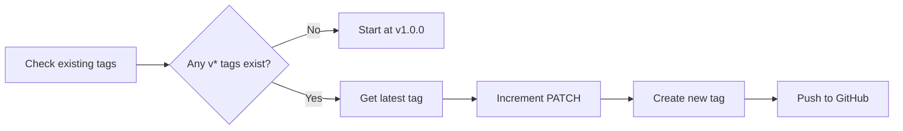
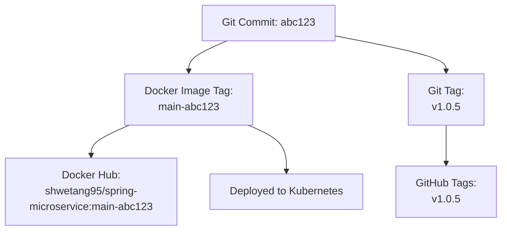
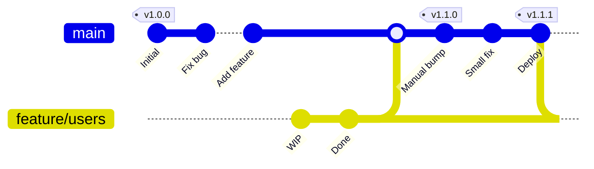

# 12 - Auto Semantic Versioning

This document explains how our pipeline automatically creates version numbers and tags for every deployment.

---

## 🎯 What is Semantic Versioning?

Semantic versioning (SemVer) uses three numbers: **MAJOR.MINOR.PATCH**

```
v1.2.3
│ │ │
│ │ └── PATCH: Bug fixes, small changes (no breaking changes)
│ └──── MINOR: New features (backwards compatible)
└────── MAJOR: Breaking changes (not backwards compatible)
```

### Examples

| Version Change | When to use | Example |
|----------------|-------------|---------|
| `v1.0.0` → `v1.0.1` | Fixed a bug | Fixed null pointer exception |
| `v1.0.1` → `v1.1.0` | Added a feature | Added new `/users` endpoint |
| `v1.1.0` → `v2.0.0` | Breaking change | Changed API response format |

---

## 🤖 How Our Pipeline Auto-Generates Versions

Our CD pipeline automatically increments the **PATCH** version on every successful deployment.



### Automatic Version Progression

| Deploy # | What happens | Version |
|----------|-------------|---------|
| 1st deploy ever | No tags exist, start fresh | `v1.0.0` |
| 2nd deploy | Found v1.0.0, increment patch | `v1.0.1` |
| 3rd deploy | Found v1.0.1, increment patch | `v1.0.2` |
| 4th deploy | Found v1.0.2, increment patch | `v1.0.3` |
| ... | Keeps going | `v1.0.N` |

---

## 📜 The Bash Script Explained

Here's the version generation script from our `cd.yml`, explained line by line:

```bash
# Get the latest tag (semantic version)
LATEST_TAG=$(git tag -l "v*" --sort=-v:refname | head -n 1)
```
| Part | What it does |
|------|-------------|
| `git tag -l "v*"` | List all tags that start with "v" (v1.0.0, v1.0.1, etc.) |
| `--sort=-v:refname` | Sort by version number, descending (newest first) |
| `head -n 1` | Take only the first result (the latest/highest version) |
| `LATEST_TAG=` | Store the result in a variable |

> **Example:** If tags are v1.0.0, v1.0.1, v1.0.2 → `LATEST_TAG` = `v1.0.2`

```bash
if [ -z "$LATEST_TAG" ]; then
  # No tags yet, start at v1.0.0
  NEW_VERSION="v1.0.0"
```
| Part | What it does |
|------|-------------|
| `[ -z "$LATEST_TAG" ]` | Check if the variable is empty (no tags found) |
| `NEW_VERSION="v1.0.0"` | If no tags exist, this is our first version |

```bash
else
  # Increment patch version (v1.2.3 -> v1.2.4)
  VERSION=${LATEST_TAG#v}
```
| Part | What it does |
|------|-------------|
| `${LATEST_TAG#v}` | Strip the "v" prefix: `v1.2.3` → `1.2.3` |

```bash
  MAJOR=$(echo $VERSION | cut -d. -f1)
  MINOR=$(echo $VERSION | cut -d. -f2)
  PATCH=$(echo $VERSION | cut -d. -f3)
```
| Part | What it does | Example |
|------|-------------|---------|
| `cut -d. -f1` | Split by "." and take field 1 | `1.2.3` → `1` |
| `cut -d. -f2` | Split by "." and take field 2 | `1.2.3` → `2` |
| `cut -d. -f3` | Split by "." and take field 3 | `1.2.3` → `3` |

```bash
  PATCH=$((PATCH + 1))
  NEW_VERSION="v${MAJOR}.${MINOR}.${PATCH}"
fi
```
| Part | What it does | Example |
|------|-------------|---------|
| `$((PATCH + 1))` | Arithmetic: add 1 to PATCH | `3` → `4` |
| `"v${MAJOR}.${MINOR}.${PATCH}"` | Reassemble the version | `v1.2.4` |

```bash
echo "version=$NEW_VERSION" >> $GITHUB_OUTPUT
echo "🏷️ New version: $NEW_VERSION"
```
| Part | What it does |
|------|-------------|
| `>> $GITHUB_OUTPUT` | Save as a step output (other jobs can read it) |
| `echo "🏷️..."` | Print to the workflow logs (for debugging) |

---

## 🏷️ Docker Image Tags vs Git Tags

We create TWO types of tags, and they serve different purposes:

| | Docker Image Tag | Git Tag |
|---|---|---|
| **What** | Tag on the Docker image in Docker Hub | Tag on the Git commit in GitHub |
| **Format** | `main-bc013c3` (branch-sha) | `v1.0.5` (semantic version) |
| **Purpose** | Identify which build to deploy | Track release history |
| **Where** | Docker Hub | GitHub Releases/Tags page |
| **Created by** | Step: "Generate image tag" | Job: "create-tag" |

### How they relate



> **The Docker tag** (`main-abc123`) is what actually gets deployed. It's used in `deployment.yml`.  
> **The Git tag** (`v1.0.5`) is for humans — it marks the commit as a release for tracking purposes.

---

## ✋ How to Manually Bump Minor or Major Version

Our pipeline only auto-increments PATCH. For MINOR or MAJOR bumps, you need to create the tag manually:

### Bump MINOR Version (v1.0.5 → v1.1.0)

```bash
# In the spring-microservice-cicd repo
git tag -a v1.1.0 -m "Release v1.1.0 - Added new user endpoints"
git push origin v1.1.0
```

> **Next automatic deploy will be:** v1.1.1 (increments PATCH from the new base)

### Bump MAJOR Version (v1.5.3 → v2.0.0)

```bash
git tag -a v2.0.0 -m "Release v2.0.0 - Breaking API changes"
git push origin v2.0.0
```

> **Next automatic deploy will be:** v2.0.1

### Why manual?

Semantic versioning decisions require human judgment:
- "Is this a breaking change?" → Only you know
- "Is this a new feature or a fix?" → Only you know
- The pipeline can't decide, so it defaults to PATCH (safest)

---

## 👀 Where to See Tags on GitHub

### Method 1: Tags Page

1. Go to: https://github.com/Shway95/spring-microservice-cicd
2. Click **"Tags"** (next to the branch dropdown) or navigate to the **Releases** tab
3. You'll see all version tags listed:

```
v1.0.5  ← Latest
v1.0.4
v1.0.3
v1.0.2
v1.0.1
v1.0.0  ← First release
```

### Method 2: Direct URL

```
https://github.com/Shway95/spring-microservice-cicd/tags
```

### Method 3: Command Line

```bash
# List all tags (newest first)
git tag --sort=-v:refname

# Show details about a specific tag
git show v1.0.5

# Output:
# tag v1.0.5
# Tagger: github-actions[bot]
# Date: Thu Jun 15 2024 10:30:00
#
# Release v1.0.5 - Branch: main, SHA: bc013c3...
```

---

## 📊 Version History Example



---

## ❓ FAQ

**Q: What if two pipelines run at the same time?**  
A: They might try to create the same version. The second one will fail to push the tag (tag already exists). This is rare and can be fixed by re-running the failed pipeline.

**Q: Can I delete a tag?**  
```bash
# Delete locally
git tag -d v1.0.5

# Delete remotely
git push origin --delete v1.0.5
```

**Q: Why not use the commit SHA as the version?**  
A: SHAs like `bc013c3` aren't human-friendly. `v1.0.5` instantly tells you "5th patch since release 1.0". SHAs tell you nothing about sequence.

**Q: Do tags trigger the CD pipeline?**  
A: No! Our pipeline triggers on branch pushes, not tag pushes. The tag is created AFTER the pipeline runs.

---

## 📝 Key Takeaways

1. **Semantic versioning** = MAJOR.MINOR.PATCH
2. **Auto-increment** = Pipeline bumps PATCH automatically
3. **Manual bump** = Create a tag manually for MINOR/MAJOR changes
4. **Docker tags** (`main-abc123`) = For deployment identification
5. **Git tags** (`v1.0.5`) = For release history tracking
6. **`fetch-depth: 0`** = Required for the script to see all existing tags
7. **`permissions: contents: write`** = Required for the pipeline to push tags
