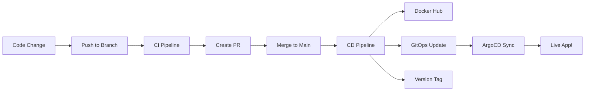
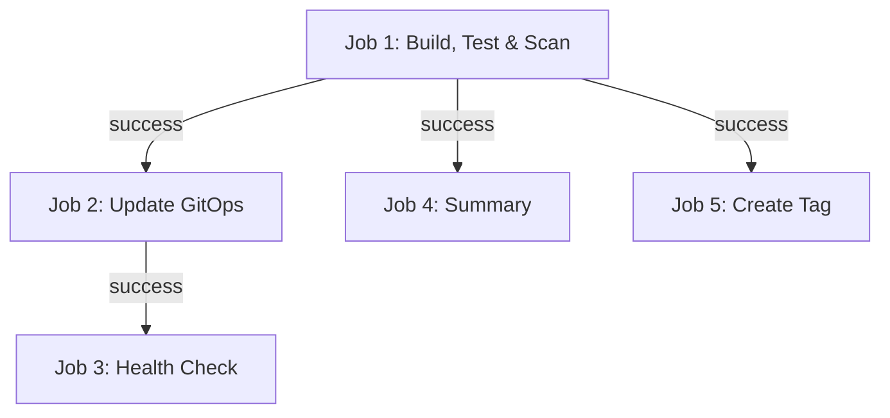

# 13 - Testing the Full Pipeline End-to-End

This document walks you through testing the complete CI/CD pipeline from a code change all the way to a running deployment.

---

## 🎯 What We're Testing

The full flow:



---

## Step 1: Make a Code Change on a Feature Branch

### Create a feature branch and make a change

```bash
# Navigate to your app repo
cd spring-microservice-cicd

# Create a feature branch
git checkout -b feature/test-pipeline

# Make a small change (e.g., update the greeting message)
# Edit src/main/java/com/shway/microservice/controller/GreetingController.java
```

**Example change:**
```java
// Change the greeting message
@GetMapping("/hello")
public String hello() {
    return "Hello from CI/CD Pipeline v2!";  // ← Changed this
}
```

### Commit the change

```bash
git add .
git commit -m "feat: update greeting message for pipeline test"
```

---

## Step 2: Push and Watch CI Pipeline

### Push to GitHub

```bash
git push -u origin feature/test-pipeline
```

### Watch the CI Pipeline

1. Go to: https://github.com/Shway95/spring-microservice-cicd/actions
2. You should see a new workflow run: **"CI Pipeline - Build & Test"**
3. Click on it to watch the steps:

**What to check:**
| Step | Expected Result |
|------|----------------|
| Checkout code | ✅ Success |
| Set up JDK 21 | ✅ Success |
| Setup Gradle | ✅ Success |
| Build application | ✅ Success (no compile errors) |
| Run tests | ✅ Success (all tests pass) |
| Gitleaks - Secret Scanning | ✅ Success (no secrets found) |
| Build Docker image (test) | ✅ Success |
| Trivy - Image Vulnerability Scan | ✅ Success (or warnings) |

> ⏱️ **Expected duration:** 2-4 minutes

---

## Step 3: Create a PR and Merge

### Create a Pull Request

1. Go to your repo on GitHub
2. You'll see a banner: "feature/test-pipeline had recent pushes"
3. Click **"Compare & pull request"**
4. Fill in:
   - **Title:** `feat: update greeting message`
   - **Description:** `Testing the full CI/CD pipeline`
5. Click **"Create pull request"**

### Wait for CI to pass on the PR

- The CI pipeline runs again (on the PR event)
- Wait for the green checkmark ✅

### Merge the PR

1. Click **"Merge pull request"**
2. Click **"Confirm merge"**
3. Optionally delete the feature branch

> **This triggers the CD pipeline!** Merging to `main` starts the deployment.

---

## Step 4: Watch CD Pipeline Run

### Navigate to Actions

1. Go to: https://github.com/Shway95/spring-microservice-cicd/actions
2. You should see a new workflow: **"CD Pipeline - Build, Push & Deploy"**
3. Click on it to watch

### What to check



| Job | Step | Expected |
|-----|------|----------|
| build-test-scan | Build + Test | ✅ Pass |
| build-test-scan | Gitleaks scan | ✅ No secrets |
| build-test-scan | Generate image tag | Shows tag like `main-abc123` |
| build-test-scan | Generate version | Shows version like `v1.0.5` |
| build-test-scan | Docker build | ✅ Image built |
| build-test-scan | Trivy scan | ✅ (or warnings with exit-code 0) |
| build-test-scan | Push to Docker Hub | ✅ Pushed |
| update-gitops | Checkout GitOps repo | ✅ Cloned |
| update-gitops | Update image tag | Shows new tag |
| update-gitops | Commit and push | ✅ Pushed to GitOps repo |
| create-tag | Create and push tag | Shows `🏷️ Tagged: v1.0.X` |

> ⏱️ **Expected duration:** 3-5 minutes for the full CD pipeline

---

## Step 5: Check Docker Hub for New Image

### Verify the image was pushed

1. Go to: https://hub.docker.com/r/shwetang95/spring-microservice/tags
2. You should see the new tag:

```
Tags:
  main-abc123    Just now       156 MB    ← NEW!
  latest         Just now       156 MB    ← Updated!
  main-xyz789    2 hours ago    155 MB    ← Previous build
```

### Or use command line

```bash
docker pull shwetang95/spring-microservice:main-abc123
# Should download successfully
```

---

## Step 6: Check GitOps Repo for Updated Tag

### Verify the deployment.yml was updated

1. Go to: https://github.com/Shway95/spring-microservice-gitops
2. Click on the `dev/` folder
3. Open `deployment.yml`
4. Check the `image` field:

```yaml
image: shwetang95/spring-microservice:main-abc123    ← Should be the NEW tag!
```

### Check the commit history

1. Click on **"Commits"** or the commit count
2. You should see a recent commit:

```
Update dev image to main-abc123
  by github-actions[bot], 2 minutes ago
```

---

## Step 7: Check ArgoCD Dashboard for Sync

### Open ArgoCD

1. Go to: http://35.175.240.246:30080
2. Login: `admin` / `XvKzqiOZtKDZCbLg`

### What to look for

| Status | Meaning | Action |
|--------|---------|--------|
| **Synced + Healthy** ✅ | Deployment successful! | None — you're done! |
| **Synced + Progressing** 🔄 | Rolling update in progress | Wait 30-60 seconds |
| **OutOfSync** ⚠️ | ArgoCD hasn't synced yet | Wait or click "Sync" |
| **Degraded** 🔴 | New pod is crashing | Check pod logs |

### Check the app details

1. Click on **"spring-microservice-dev"** app
2. You should see the pod with the new image tag
3. Check that the pod status is "Running" with green checkmark

---

## Step 8: Test the Live App Endpoint

### Call the API

```bash
# Health check
curl http://35.175.240.246:32130/actuator/health
# Expected: {"status":"UP"}

# Your updated endpoint
curl http://35.175.240.246:32130/hello
# Expected: "Hello from CI/CD Pipeline v2!"

# Environment info
curl http://35.175.240.246:32130/env
# Shows environment variables from ConfigMap
```

### From a browser

Just open: http://35.175.240.246:32130/actuator/health

---

## Step 9: Verify Version Tag Was Created

### On GitHub

1. Go to: https://github.com/Shway95/spring-microservice-cicd/tags
2. You should see the new version tag:

```
v1.0.5    ← NEW! Created just now
v1.0.4    ← Previous
v1.0.3
...
```

### Click on the tag to see details

```
Release v1.0.5 - Branch: main, SHA: abc123def456...
Tagged by github-actions[bot]
```

---

## ✅ Success Checklist

Use this checklist to verify everything worked:

- [ ] CI pipeline passed on feature branch
- [ ] PR created and CI passed on PR
- [ ] PR merged to main
- [ ] CD pipeline ran successfully (all 5 jobs green)
- [ ] New image visible on Docker Hub with correct tag
- [ ] GitOps repo `deployment.yml` has new image tag
- [ ] ArgoCD shows "Synced + Healthy"
- [ ] App responds at the endpoint with new changes
- [ ] New version tag (v1.0.X) exists on GitHub

---

## 🕐 Timeline: What Happens When

```mermaid
gantt
    title Pipeline Timeline
    dateFormat X
    axisFormat %s

    section CI (Feature Branch)
    Push to feature branch      :0, 1
    CI Build & Test            :1, 4

    section PR & Merge
    Create PR                  :4, 5
    CI runs on PR              :5, 8
    Merge to main              :8, 9

    section CD Pipeline
    Build & Test               :9, 12
    Docker Push                :12, 13
    Update GitOps              :13, 14
    Create Tag                 :13, 14
    
    section ArgoCD
    Detect change              :14, 15
    Pull new image             :15, 16
    Rolling update             :16, 17
    Health check passes        :17, 18
```



> **Total time from merge to live deployment:** ~5-7 minutes

---

## 🔧 If Something Goes Wrong

| Symptom | Where to look | Common fix |
|---------|---------------|------------|
| CI fails on test | Actions tab → failed step logs | Fix the failing test |
| Docker push denied | CD pipeline logs | Check DOCKERHUB_USERNAME secret |
| GitOps push 403 | CD pipeline logs | Check GITOPS_TOKEN permissions |
| Tag push 403 | CD pipeline logs | Ensure `permissions: contents: write` |
| ArgoCD OutOfSync | ArgoCD dashboard | Wait or click Sync manually |
| Pod CrashLoopBackOff | `kubectl logs <pod> -n dev` | Check app logs for errors |
| ImagePullBackOff | `kubectl describe pod -n dev` | Image name mismatch |

> For detailed error solutions, see [14-TROUBLESHOOTING.md](./14-TROUBLESHOOTING.md)

---

## 📝 Key Takeaways

1. **End-to-end takes ~5-7 minutes** from merge to live deployment
2. **Check each stage** — if one fails, later stages won't run
3. **ArgoCD auto-syncs** — you don't need to do anything after GitOps push
4. **Docker Hub** is your audit trail for what was built
5. **Git tags** are your audit trail for what was released
6. **The GitOps repo commit history** shows exactly what was deployed when
