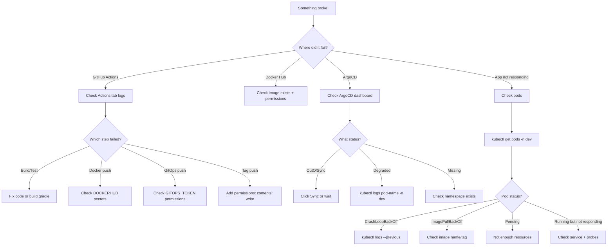

# 14 - Troubleshooting Guide

This document covers every error we encountered building this CI/CD pipeline and how we fixed them. Use this as your first reference when something breaks.

---

## 🎯 Quick Reference: Error → Fix

| Error | Quick Fix |
|-------|-----------|
| `./gradlew not found` | Use `gradle` command with `setup-gradle` action |
| Gradle 9.x incompatible | Pin to `gradle-version: '8.8'` |
| Trivy CRITICAL CVEs | Set `exit-code: '0'` or upgrade Spring Boot |
| Docker push denied | Check `DOCKERHUB_USERNAME` matches your Docker Hub account |
| GitOps push 403 | GITOPS_TOKEN needs Contents: Read & Write permission |
| Tag push 403 | Add `permissions: contents: write` to the job |
| ImagePullBackOff | Image name in deployment.yml doesn't match Docker Hub |
| OutOfSync in ArgoCD | Manual changes on cluster; sync or enable selfHeal |
| ArgoCD Degraded | Pod is crashing; check pod logs |

---

## 🔨 Detailed Error Solutions

### 1. `./gradlew: not found`

**Error message:**
```
/home/runner/work/_temp/xxxxx.sh: line 1: ./gradlew: No such file or directory
Error: Process completed with exit code 127.
```

**Cause:** The Gradle wrapper script (`gradlew`) wasn't committed to the repository, or it doesn't have execute permissions.

**Fix:** Don't use `./gradlew`. Instead, use the `setup-gradle` action which installs Gradle directly:

```yaml
# ❌ WRONG - gradlew might not exist
- name: Build
  run: ./gradlew build

# ✅ CORRECT - use setup-gradle action
- name: Setup Gradle
  uses: gradle/actions/setup-gradle@v3
  with:
    gradle-version: '8.8'

- name: Build
  run: gradle build --no-daemon
```

**Why this works:** The `setup-gradle` action downloads and configures Gradle independently of any wrapper files in your repo.

---

### 2. Gradle 9.x Incompatibility

**Error message:**
```
Could not compile build file 'build.gradle'
> Unsupported class file major version XX
```
Or various deprecation/removed API errors.

**Cause:** Gradle 9.x removed features that our `build.gradle` relies on. Our project was written for Gradle 8.x.

**Fix:** Pin to Gradle 8.8 in the setup action:

```yaml
- name: Setup Gradle
  uses: gradle/actions/setup-gradle@v3
  with:
    gradle-version: '8.8'    # ← Pin to 8.8, NOT latest!
```

**Why 8.8?** It's the latest stable 8.x version with full compatibility for our project.

---

### 3. Trivy Reports CRITICAL CVEs

**Error message:**
```
CRITICAL: 3 (HIGH: 5, CRITICAL: 3)
┌──────────────────────────┬────────────────┬──────────┐
│ Library                  │ Vulnerability  │ Severity │
├──────────────────────────┼────────────────┼──────────┤
│ org.springframework:xxx  │ CVE-2024-xxxxx │ CRITICAL │
└──────────────────────────┴────────────────┴──────────┘
Error: Process completed with exit code 1.
```

**Cause:** The Docker image contains libraries with known security vulnerabilities.

**Fix Option 1: Don't fail the pipeline** (what we do)
```yaml
- name: Trivy Scan
  uses: aquasecurity/trivy-action@master
  with:
    image-ref: 'my-image:tag'
    exit-code: '0'           # ← Report but don't fail
    ignore-unfixed: true     # ← Skip CVEs with no fix available
    severity: 'CRITICAL'     # ← Only report CRITICAL
```

**Fix Option 2: Upgrade Spring Boot**
```gradle
// build.gradle
plugins {
    id 'org.springframework.boot' version '3.3.0'  // ← Update to latest
}
```

**When to use which:**
- **Option 1:** When CVEs are in transitive dependencies you can't control
- **Option 2:** When the CVE is in Spring Boot itself

---

### 4. Docker Push Denied

**Error message:**
```
denied: requested access to the resource is denied
```

**Cause:** The `DOCKERHUB_USERNAME` secret doesn't match your actual Docker Hub username, OR the token doesn't have push permissions.

**Fix checklist:**

1. **Verify username:** Go to Docker Hub → Profile → check your exact username
2. **Check the secret in GitHub:**
   - Settings → Secrets → Actions
   - Delete and re-create `DOCKERHUB_USERNAME` with the EXACT username
3. **Check the image name in `env` block:**
```yaml
env:
  DOCKER_IMAGE: shwetang95/spring-microservice
  #             ^^^^^^^^^^
  #             Must match your Docker Hub username EXACTLY
```
4. **Check token permissions:** Token must have "Read & Write" (not "Read only")

---

### 5. GitOps Push 403 Forbidden

**Error message:**
```
remote: Permission to Shway95/spring-microservice-gitops.git denied to github-actions[bot].
fatal: unable to access 'https://github.com/Shway95/spring-microservice-gitops.git/': The requested URL returned error: 403
```

**Cause:** The `GITOPS_TOKEN` (Personal Access Token) doesn't have permission to push to the GitOps repository.

**Fix:**

1. Go to: https://github.com/settings/tokens?type=beta
2. Find your token (or create a new one)
3. Ensure it has:
   - **Repository access:** "Only select repositories" → select `spring-microservice-gitops`
   - **Permissions → Contents:** **Read and Write** ✅
4. Copy the new token
5. Update the secret in GitHub:
   - Go to `spring-microservice-cicd` repo → Settings → Secrets → Actions
   - Delete `GITOPS_TOKEN`
   - Create new `GITOPS_TOKEN` with the updated token value

**Common mistakes:**
- Token scoped to wrong repo (must include the GitOps repo!)
- Token has only "Read" permission (needs "Read and Write")
- Token expired (check expiration date)

---

### 6. Tag Push 403 Forbidden

**Error message:**
```
! [remote rejected] v1.0.5 -> v1.0.5 (permission denied)
error: failed to push some refs to 'https://github.com/Shway95/spring-microservice-cicd'
```

**Cause:** The `GITHUB_TOKEN` doesn't have write permission to push tags.

**Fix:** Add `permissions: contents: write` to the job that creates tags:

```yaml
  create-tag:
    runs-on: ubuntu-latest
    permissions:
      contents: write    # ← ADD THIS!
    steps:
      - name: Checkout
        uses: actions/checkout@v4
        with:
          fetch-depth: 0
      - name: Create tag
        run: |
          git tag -a "v1.0.5" -m "Release"
          git push origin "v1.0.5"
```

**Why:** By default, `GITHUB_TOKEN` has **read-only** access to repo contents. The `permissions` block elevates it to write access for that specific job only.

---

### 7. ImagePullBackOff

**Error message (from kubectl):**
```
Events:
  Warning  Failed     10s   kubelet  Failed to pull image "shwetang95/spring-microservice:main-abc123": 
           rpc error: code = NotFound desc = failed to pull and unpack image: not found
  Warning  Failed     10s   kubelet  Error: ImagePullBackOff
```

**Cause:** Kubernetes can't find the Docker image. The image name or tag in `deployment.yml` doesn't match what's on Docker Hub.

**Fix checklist:**

1. **Check what tag is in deployment.yml:**
```bash
kubectl get deployment spring-microservice -n dev -o jsonpath="{.spec.template.spec.containers[0].image}"
# Output: shwetang95/spring-microservice:main-abc123
```

2. **Check if that exact tag exists on Docker Hub:**
   - Go to https://hub.docker.com/r/shwetang95/spring-microservice/tags
   - Search for the tag

3. **Common causes:**
   - Typo in image name (check `DOCKER_IMAGE` env variable)
   - CD pipeline failed AFTER generating the tag but BEFORE pushing the image
   - Image was deleted from Docker Hub

4. **Quick fix:**
```bash
# Force-update to latest known-good tag
kubectl set image deployment/spring-microservice app=shwetang95/spring-microservice:latest -n dev
```

> ⚠️ If selfHeal is enabled, ArgoCD will revert this! Fix in the GitOps repo instead.

---

### 8. ArgoCD Shows OutOfSync

**Symptoms:** ArgoCD dashboard shows the app as "OutOfSync" with yellow warning.

**Cause:** The live cluster state differs from what's in the GitOps repo. Usually caused by:
- Someone ran `kubectl edit` or `kubectl scale` directly on the cluster
- A ConfigMap or Secret was changed manually
- ArgoCD hasn't synced yet (normal if within 3-minute polling interval)

**Fix options:**

| Approach | How | When |
|----------|-----|------|
| Wait | ArgoCD polls every ~3 minutes | If you just pushed to GitOps |
| Manual sync | Click "Sync" in ArgoCD UI | If you're impatient |
| Enable selfHeal | Set `selfHeal: true` in ArgoCD App | Permanent fix |
| Revert manual change | Undo whatever `kubectl` command you ran | If you made a mistake |

**To enable selfHeal:**
```yaml
syncPolicy:
  automated:
    prune: true
    selfHeal: true    # ← Automatically fixes drift
```

---

### 9. ArgoCD Shows Degraded

**Symptoms:** ArgoCD shows the app as "Degraded" with a red heart icon.

**Cause:** The pod is running but unhealthy. Usually:
- Application is crashing (CrashLoopBackOff)
- Health probes are failing
- Missing environment variables
- Database connection refused
- Out of memory (OOMKilled)

**Fix: Check pod logs**

```bash
# See what's happening
kubectl get pods -n dev
# Look for pods in CrashLoopBackOff or Error state

# Check logs
kubectl logs <pod-name> -n dev

# If pod already crashed, check previous logs
kubectl logs <pod-name> -n dev --previous

# Get detailed status
kubectl describe pod <pod-name> -n dev
```

**Common log errors and fixes:**

| Log Error | Fix |
|-----------|-----|
| `java.lang.OutOfMemoryError` | Increase memory limits in deployment.yml |
| `Connection refused: localhost:5432` | Check DB_HOST in ConfigMap |
| `No active profile set` | Check SPRING_PROFILES_ACTIVE in ConfigMap |
| `Bean creation exception` | Usually a missing env var or wrong config |
| `Address already in use: 8080` | Pod isn't fully terminating; restart deployment |

---

## 🔍 How to Debug

### GitHub Actions Logs

1. Go to: https://github.com/Shway95/spring-microservice-cicd/actions
2. Click on the failed run
3. Click on the failed job
4. Click on the failed step
5. Read the error message

**Tips:**
- Expand the full step output by clicking the step name
- Look at the LAST few lines — that's usually where the error is
- Check the step BEFORE the failed one — it might have produced bad output

---

### kubectl Commands for Debugging

```bash
# What pods are running?
kubectl get pods -n dev
# Status should be "Running". Watch for:
#   - CrashLoopBackOff (app keeps crashing)
#   - ImagePullBackOff (can't download image)
#   - Pending (not enough resources)
#   - Error (startup failed)

# WHY is a pod failing?
kubectl describe pod <pod-name> -n dev
# Scroll to "Events" section at the bottom

# What is the app printing?
kubectl logs <pod-name> -n dev

# Follow logs in real-time
kubectl logs <pod-name> -n dev -f

# Get into the container (like SSH)
kubectl exec -it <pod-name> -n dev -- /bin/sh
# Then you can run: env, curl, cat, etc.

# What events happened recently?
kubectl get events -n dev --sort-by='.lastTimestamp'

# Check if ConfigMap is correct
kubectl get configmap spring-microservice-config -n dev -o yaml

# Check if Secret exists
kubectl get secret spring-microservice-secrets -n dev
```

---

### ArgoCD Debugging

```bash
# Check ArgoCD app status
kubectl get applications -n argocd

# Detailed app status
kubectl describe application spring-microservice-dev -n argocd

# ArgoCD server logs
kubectl logs -n argocd deployment/argocd-server

# ArgoCD controller logs (handles syncing)
kubectl logs -n argocd statefulset/argocd-application-controller
```

---

## 🗺️ Decision Tree: Where to Look



---

## 🆘 Emergency Commands

```bash
# "Just make it work again" - restart everything
kubectl rollout restart deployment/spring-microservice -n dev

# Revert to last known-good version (ArgoCD)
# Go to ArgoCD UI → App → History → Rollback

# Force ArgoCD to sync NOW
kubectl patch application spring-microservice-dev -n argocd --type merge -p '{"operation": {"sync": {}}}'

# Check if cluster has resources
kubectl top nodes
kubectl top pods -n dev

# Nuclear option: delete pod (Deployment will recreate it)
kubectl delete pod <pod-name> -n dev
```

---

## 📋 Pre-Flight Checklist

Before pushing to main, verify:

- [ ] Code compiles locally: `gradle build`
- [ ] Tests pass locally: `gradle test`
- [ ] Docker builds locally: `docker build -t test .`
- [ ] All GitHub Secrets are set (DOCKERHUB_USERNAME, DOCKERHUB_TOKEN, GITOPS_TOKEN)
- [ ] GITOPS_TOKEN hasn't expired
- [ ] ArgoCD is running: check dashboard is accessible
- [ ] Target namespace exists: `kubectl get ns dev`

---

## 📝 Key Takeaways

1. **Read the error message** — it usually tells you exactly what's wrong
2. **GitHub Actions logs** — first place to check for pipeline failures
3. **kubectl logs** — first place to check for app crashes
4. **kubectl describe** — shows events (scheduling, pulling, probes)
5. **ArgoCD dashboard** — shows sync status and health
6. **Most errors are permission-related** — tokens, secrets, RBAC
7. **When in doubt, restart:** `kubectl rollout restart deployment`
8. **Always check the simplest thing first** — typo in a secret name is more common than a complex bug
