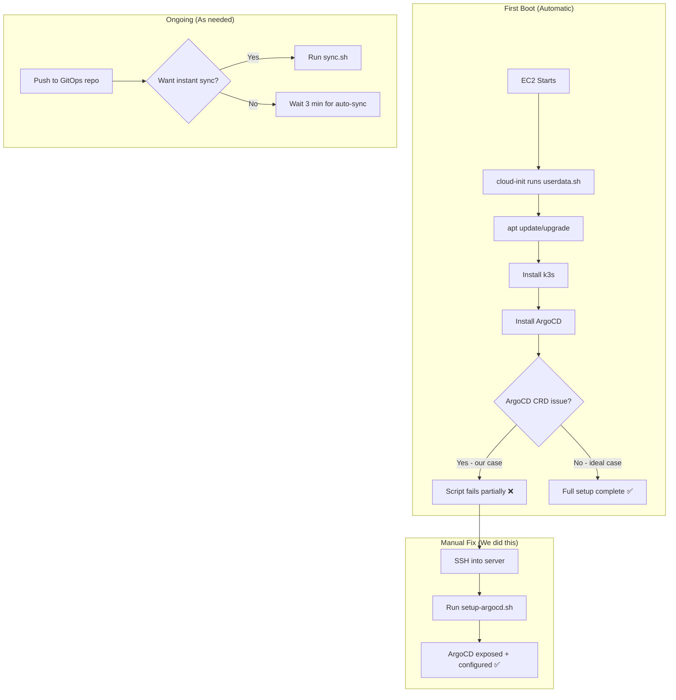

# 15 - Infrastructure Scripts Explained

This document explains the shell scripts we use to set up and manage the infrastructure (EC2, k3s, ArgoCD).

---

## 📁 Scripts Overview

```
AWS workflow/
├── userdata.sh         ← Runs automatically when EC2 starts (initial setup)
├── setup-argocd.sh     ← Manual fix script (ran when userdata partially failed)
└── sync.sh             ← Force ArgoCD to sync immediately
```

| Script | When it runs | Who runs it | Purpose |
|--------|-------------|-------------|---------|
| `userdata.sh` | Automatically on EC2 first boot | AWS (cloud-init) | Full server setup from scratch |
| `setup-argocd.sh` | Manually via SSH | You (or me via SSH) | Fix ArgoCD after partial userdata failure |
| `sync.sh` | Manually when needed | You | Force ArgoCD to sync without waiting |

---

## 📄 userdata.sh - EC2 Bootstrap Script (Line by Line)

**What is this?** When you launch an EC2 instance, you can pass a "user data" script. AWS runs this script automatically the first time the server boots. It's like an automated installer.

**When does it run?** Only ONCE — on the very first boot of the EC2 instance.

**Who runs it?** The `root` user (that's why we don't need `sudo` in the script).

```bash
#!/bin/bash
```
> **What:** Tells the system this is a Bash script (use the Bash interpreter).  
> **Every script starts with this.**

```bash
set -e
```
> **What:** "Exit on error." If any command fails, STOP the entire script immediately.  
> **Why:** Without this, if k3s install fails, the script would keep going and try to install ArgoCD on a non-existent Kubernetes — causing confusing errors.  
> **Tradeoff:** In our case, this actually caused an issue — when one step failed (CRD too large), ALL remaining steps were skipped.

---

### Section 1: System Updates

```bash
# Update system
apt-get update -y
apt-get upgrade -y
```
> **`apt-get update`:** Refreshes the list of available packages (like refreshing an app store).  
> **`apt-get upgrade`:** Installs the latest versions of all installed packages.  
> **`-y`:** Auto-answer "yes" to all prompts (since there's no human to type "y").  
> **Why:** Ensures the server has latest security patches before we install anything.

---

### Section 2: Install k3s

```bash
# Install k3s
curl -sfL https://get.k3s.io | sh -
```
> **What:** Downloads and installs k3s (lightweight Kubernetes) in one command.  
> **Breakdown:**

| Part | Meaning |
|------|---------|
| `curl` | Download a URL |
| `-s` | Silent (no progress bar) |
| `-f` | Fail silently on HTTP error |
| `-L` | Follow redirects |
| `https://get.k3s.io` | The k3s install script URL |
| `\|` | Pipe the downloaded content to... |
| `sh -` | ...the shell (execute it) |

> **What it does internally:**
> 1. Detects your OS (Linux)
> 2. Downloads the k3s binary
> 3. Installs it to `/usr/local/bin/k3s`
> 4. Creates a systemd service
> 5. Starts Kubernetes

```bash
# Wait for k3s to be ready
sleep 30
export KUBECONFIG=/etc/rancher/k3s/k3s.yaml
```
> **`sleep 30`:** Wait 30 seconds for k3s to fully start up (it takes time to initialize).  
> **`export KUBECONFIG=...`:** Tells `kubectl` where to find the cluster credentials.  
> **`/etc/rancher/k3s/k3s.yaml`:** This file is automatically created by k3s and contains the authentication info to connect to the cluster.

---

### Section 3: Install ArgoCD

```bash
# Install ArgoCD
kubectl create namespace argocd
```
> **What:** Creates a Kubernetes namespace called `argocd`.  
> **Why:** ArgoCD components need their own isolated space in the cluster.

```bash
kubectl apply -n argocd -f https://raw.githubusercontent.com/argoproj/argo-cd/stable/manifests/install.yaml
```
> **What:** Downloads the ArgoCD installation manifest from GitHub and applies it to Kubernetes.  
> **Breakdown:**

| Part | Meaning |
|------|---------|
| `kubectl apply` | Create/update resources in Kubernetes |
| `-n argocd` | In the `argocd` namespace |
| `-f https://...` | From this URL (a YAML file with all ArgoCD components) |

> **What it installs:** ArgoCD server, application controller, repo server, Redis, Dex (auth), and all their RBAC rules.

```bash
# Wait for ArgoCD to be ready
sleep 60
```
> **Why 60 seconds?** ArgoCD has multiple components that need to download their container images and start up. This takes about 1 minute.

---

### Section 4: Expose ArgoCD UI

```bash
# Expose ArgoCD via NodePort on port 30080
kubectl patch svc argocd-server -n argocd -p '{"spec": {"type": "NodePort", "ports": [{"port": 443, "targetPort": 8080, "nodePort": 30080}]}}'
```
> **What:** Changes the ArgoCD service from ClusterIP (internal only) to NodePort (accessible from outside).  
> **Breakdown:**

| Part | Meaning |
|------|---------|
| `kubectl patch svc` | Modify an existing Service resource |
| `argocd-server` | The name of the ArgoCD server service |
| `-n argocd` | In the argocd namespace |
| `-p '{...}'` | The JSON patch to apply |
| `"type": "NodePort"` | Change service type to NodePort |
| `"nodePort": 30080` | Use port 30080 on the EC2 instance |

> **Result:** ArgoCD UI is now accessible at `http://<EC2-public-IP>:30080`

> **Note:** This command failed in our case due to JSON escaping issues from the userdata script, which is why we created `setup-argocd.sh` as a manual fix.

---

### Section 5: Create Namespaces

```bash
# Create namespaces for environments
kubectl create namespace dev
kubectl create namespace test
kubectl create namespace prod
```
> **What:** Creates three isolated environments within our cluster.  
> **Why:** Our GitOps repo has `dev/`, `test/`, `prod/` folders. Each deploys to its own namespace.  
> **Result:** Pods in `dev` can't see or affect pods in `prod`.

---

### Section 6: Save ArgoCD Password

```bash
# Save ArgoCD initial admin password
sleep 30
ARGO_PASS=$(kubectl -n argocd get secret argocd-initial-admin-secret -o jsonpath="{.data.password}" | base64 -d)
echo "ArgoCD Admin Password: $ARGO_PASS" > /home/ubuntu/argocd-credentials.txt
chown ubuntu:ubuntu /home/ubuntu/argocd-credentials.txt
```
> **Line-by-line:**

| Line | What it does |
|------|-------------|
| `sleep 30` | Wait for ArgoCD to generate the password secret |
| `kubectl get secret ...` | Retrieve the secret from Kubernetes |
| `-o jsonpath="{.data.password}"` | Extract just the password field |
| `\| base64 -d` | Decode from base64 to plain text |
| `echo ... > /home/ubuntu/argocd-credentials.txt` | Save to a file |
| `chown ubuntu:ubuntu ...` | Make the file owned by the `ubuntu` user (so you can read it via SSH) |

---

### Section 7: Connect ArgoCD to GitOps Repo

```bash
kubectl apply -f - <<EOF
apiVersion: v1
kind: Secret
metadata:
  name: spring-microservice-gitops
  namespace: argocd
  labels:
    argocd.argoproj.io/secret-type: repository
type: Opaque
stringData:
  type: git
  url: https://github.com/Shway95/spring-microservice-gitops.git
EOF
```
> **What:** Registers the GitOps repository with ArgoCD.  
> **How:**
> - Creates a Kubernetes Secret in the `argocd` namespace
> - The label `argocd.argoproj.io/secret-type: repository` tells ArgoCD "this is a repo config"
> - ArgoCD reads all secrets with this label and uses them as repo connections
> - `stringData.url` = the Git repo URL to watch

> **`<<EOF ... EOF`:** This is a "heredoc" — it lets you write multi-line content inline in a script.  
> **`kubectl apply -f -`:** The `-f -` means "read from stdin" (what comes from the heredoc).

---

### Section 8: Create ArgoCD Application

```bash
kubectl apply -f - <<EOF
apiVersion: argoproj.io/v1alpha1
kind: Application
metadata:
  name: spring-microservice-dev
  namespace: argocd
spec:
  project: default
  source:
    repoURL: https://github.com/Shway95/spring-microservice-gitops.git
    targetRevision: main
    path: dev
  destination:
    server: https://kubernetes.default.svc
    namespace: dev
  syncPolicy:
    automated:
      prune: true
      selfHeal: true
EOF
```
> **What:** Creates an ArgoCD "Application" — this is what tells ArgoCD to deploy your app.  
> **Key fields:**

| Field | Value | What it means |
|-------|-------|---------------|
| `source.repoURL` | GitOps repo URL | Where to find the manifests |
| `source.path` | `dev` | Which folder in the repo |
| `source.targetRevision` | `main` | Which branch to track |
| `destination.namespace` | `dev` | Deploy to the `dev` namespace |
| `syncPolicy.automated` | present | Auto-deploy when Git changes |
| `prune: true` | true | Delete resources removed from Git |
| `selfHeal: true` | true | Revert manual cluster changes |

---

### Section 9: Write Final Status

```bash
echo "=== SETUP COMPLETE ===" >> /home/ubuntu/argocd-credentials.txt
echo "ArgoCD URL: https://<PUBLIC_IP>:30080" >> /home/ubuntu/argocd-credentials.txt
echo "Username: admin" >> /home/ubuntu/argocd-credentials.txt
```
> **What:** Appends final info to the credentials file.  
> **`>>`:** Append (not overwrite). `>` would overwrite the entire file.

---

## 📄 setup-argocd.sh - Manual Fix Script (Line by Line)

**Why does this exist?** The `userdata.sh` script partially failed (the ArgoCD CRD was too large for annotations). This script was created to manually finish what userdata couldn't.

**How to run it:**
```bash
# Copy to server
scp -i k3s-cicd-key.pem setup-argocd.sh ubuntu@35.175.240.246:/home/ubuntu/

# SSH in and run
ssh -i k3s-cicd-key.pem ubuntu@35.175.240.246
sudo bash /home/ubuntu/setup-argocd.sh
```

```bash
#!/bin/bash
# Patch ArgoCD to NodePort
kubectl -n argocd delete svc argocd-server
kubectl -n argocd expose deployment argocd-server --type=NodePort --name=argocd-server --port=80 --target-port=8080
kubectl -n argocd expose deployment argocd-server --type=NodePort --name=argocd-server-https --port=443 --target-port=8080
```
> **What:** Instead of patching the existing service (which had JSON escaping issues), we delete it and recreate as NodePort.  
> **Why delete + recreate?** The `kubectl patch` approach requires complex JSON that breaks in heredocs and Windows SSH. Delete + expose is simpler.

```bash
# Get ArgoCD password
ARGO_PASS=$(kubectl -n argocd get secret argocd-initial-admin-secret -o jsonpath="{.data.password}" | base64 -d)
echo "ArgoCD Admin Password: $ARGO_PASS" > /home/ubuntu/argocd-credentials.txt
```
> **Same as userdata.sh** — retrieves and saves the password.

```bash
# Get NodePort
NODE_PORT=$(kubectl -n argocd get svc argocd-server -o jsonpath="{.spec.ports[0].nodePort}")
echo "ArgoCD NodePort: $NODE_PORT" >> /home/ubuntu/argocd-credentials.txt
```
> **What:** When Kubernetes assigns a NodePort, it picks a random port (30000-32767). This line reads what port was assigned.

```bash
echo "ArgoCD URL: http://$(curl -s http://169.254.169.254/latest/meta-data/public-ipv4):$NODE_PORT" >> /home/ubuntu/argocd-credentials.txt
```
> **What:** Gets the EC2 instance's public IP and builds the full URL.  
> **`169.254.169.254`:** This is the AWS metadata service — a special IP available inside every EC2 instance that returns information about itself.  
> **`/latest/meta-data/public-ipv4`:** Returns the public IPv4 address of this instance.

The rest (GitOps repo + ArgoCD app) is identical to the userdata.sh sections above.

---

## 📄 sync.sh - Force Sync (Line by Line)

**What is this?** A tiny script to force ArgoCD to sync immediately instead of waiting for the 3-minute polling interval.

**When to use:** After you push to the GitOps repo and don't want to wait.

```bash
#!/bin/bash
# Force sync ArgoCD app
kubectl -n argocd patch app spring-microservice-dev -p '{"operation":{"initiatedBy":{"username":"admin"},"sync":{"syncStrategy":{"apply":{"force":true}}}}}' --type merge
```

> **Breakdown:**

| Part | Meaning |
|------|---------|
| `kubectl patch app` | Modify an ArgoCD Application resource |
| `spring-microservice-dev` | The name of our ArgoCD app |
| `-n argocd` | In the argocd namespace |
| `--type merge` | Merge this JSON into the existing resource |
| `"operation"` | Trigger an operation (sync) |
| `"initiatedBy": {"username": "admin"}` | Who triggered it (for audit log) |
| `"sync"` | Type of operation = sync |
| `"syncStrategy": {"apply": {"force": true}}` | Force apply (overwrite conflicts) |

> **Result:** ArgoCD immediately starts syncing without waiting for the next poll.

**How to run:**
```bash
# Copy to server and run
scp -i k3s-cicd-key.pem sync.sh ubuntu@35.175.240.246:/tmp/
ssh -i k3s-cicd-key.pem ubuntu@35.175.240.246 "sudo bash /tmp/sync.sh"
```

---

## 🔄 Script Execution Flow



---

## 🆚 When to Use Which Script

| Situation | Script | How |
|-----------|--------|-----|
| Fresh EC2 setup from scratch | `userdata.sh` | Pass as user-data during EC2 launch |
| ArgoCD partially installed but not exposed | `setup-argocd.sh` | SCP to server + run manually |
| Want to force immediate deployment | `sync.sh` | SCP to server + run manually |
| Everything working, just pushed code | None needed | ArgoCD auto-syncs in ~3 min |

---

## ⚠️ Known Issue: Why userdata.sh Partially Failed

The error from cloud-init logs:
```
The CustomResourceDefinition "applicationsets.argoproj.io" is invalid: 
metadata.annotations: Too long: may not be more than 262144 bytes
```

**Cause:** ArgoCD's CRD (Custom Resource Definition) file has annotations larger than Kubernetes allows. This is a known ArgoCD issue with certain Kubernetes versions.

**Impact:** `set -e` caused the script to exit at this point, skipping:
- Namespace creation
- Password saving
- ArgoCD app creation

**Resolution:** We ran `setup-argocd.sh` manually to complete the remaining steps.

**Prevention:** In production, either:
- Use ArgoCD Helm chart (handles CRDs differently)
- Remove `set -e` and handle errors individually
- Use `kubectl apply --server-side=true` for CRDs

---

## 📝 Key Takeaways

1. **`userdata.sh`** = Automated EC2 bootstrap (runs once at first boot)
2. **`setup-argocd.sh`** = Manual fix for when automation partially fails
3. **`sync.sh`** = Force immediate ArgoCD sync
4. **`set -e`** = Good practice but can cause cascading failures
5. **`<<EOF`** = Heredoc for inline multi-line content in scripts
6. **`169.254.169.254`** = AWS metadata service (get instance info from inside)
7. **`kubectl apply -f -`** = Apply YAML from stdin (piped or heredoc)
8. **NodePort** = Exposes a service on a random port in 30000-32767 range
